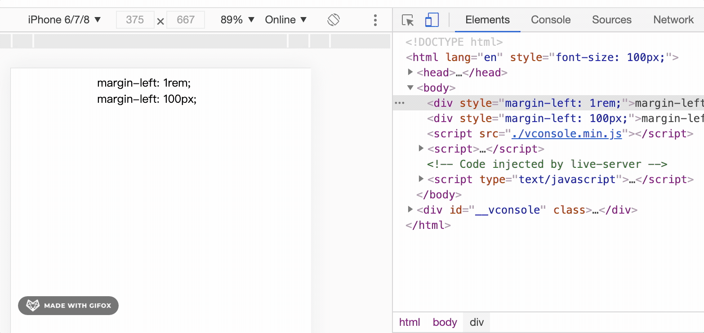
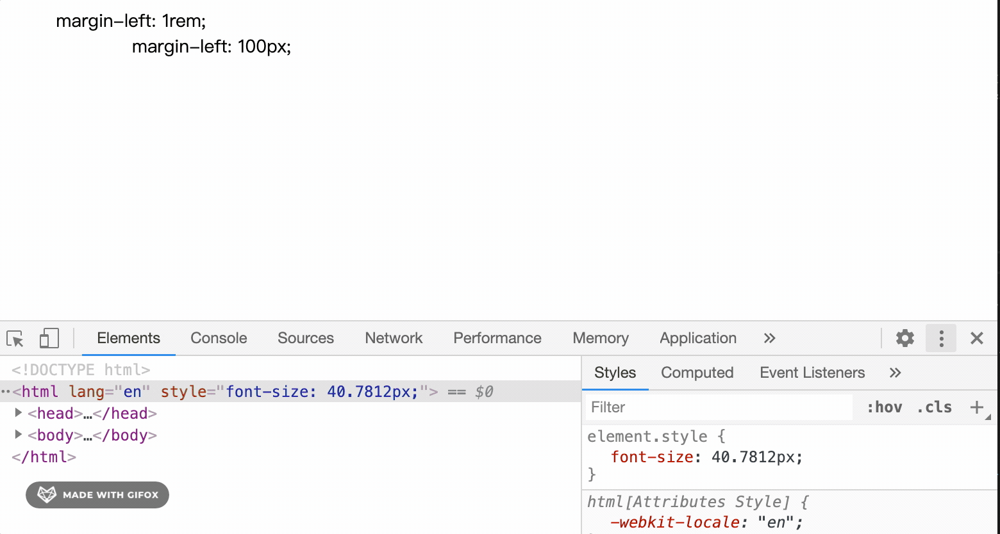

---
{
  "title": "移动端rem自适应与pc端rem自适应",
  "staticFileName": "rem.html",
  "author": "guoqzuo",
  "createDate": "2020/09/24",
  "description": "在还原设计稿稿时，对于展示型的页面，设计稿间距都是固定的px，那我们实现时，如果全部都用pixel(px)写死就会存在某些分辨率下显示比较差的问题。用百分比也可以，但你需要自己手动计算，现在一般比较好的方法是在合适的地方使用rem，他可以自动转换。先来复习下css rem的概念。在css中有以下几种相对长度单位，em表示相对当前父元素字体大小的倍数, rem表示相对根元素(html)字体的倍数。",
  "keywords": "pc rem,h5 rem,em与rem的区别",
  "category": "CSS"
}
---

# 移动端rem自适应与pc端rem自适应

在还原设计稿稿时，对于展示型的页面，设计稿间距都是固定的px，那我们实现时，如果全部都用pixel(px)写死就会存在某些分辨率下显示比较差的问题。用百分比也可以，但你需要自己手动计算，现在一般比较好的方法是在合适的地方使用rem，他可以自动转换。

先来复习下css rem的概念。在css中有以下几种相对长度单位

- em表示相对当前父元素字体大小的倍数
- rem表示相对根元素(html)字体的倍数。
- %百分比如果是font-size挂钩的是父元素的font-size的百分比，如果是width，挂钩的是元素包含块的宽度
- vh viewport视口高度，一般height可以设置为 html {min-height:100vh}
- vw 视口宽度(1vw = 1%)。不过一般默认宽度就是100%，宽度用百分比多。高度是由于默认高度不是100%，如果需要表示全屏，使用100vh会比较方便。

参考 [css相对长度 | HTML5权威指南笔记](https://www.yuque.com/guoqzuo/js_es6/dg9u82#92bb76d4)


举个例子：

设计稿尺寸是 750 * 1334，假设某个图片距离顶部是100px，且需要根据屏幕尺寸自动调整间距，那么我们将 margin-top 设置为 1rem 即可。如果是 45px，设置为 0.45rem。

为了好还原UI图，1rem通常设计为100px。rem是相对于html元素font-size来计算的，我们可以通过动态的改变html元素的fontSize，来实现响应式布局



## 移动端rem自适应
获取当前浏览器窗口宽高 document.documentElement.clientHeight * document.documentElement.clientWidth

机型 | 屏幕尺寸 | window.devicePixelRatio
--- | --- | ---
iPhone 5/SE | 320 * 568 | 2
iPhone 6/7/8 | 375 * 667 | 2
iPhone 6/7/8 Plus | 414 * 736 | 3
iPhone X | 375 * 812 | 3
iPhone XR | 414 * 896 | 2
iPhone XS Max | 414 * 896 | 3
iPad | 768 * 1024 | 2
iPad pro 10.5-inch | 834 * 1112 | 2
iPad pro 12.9-inch | 1024 * 1366 | 2

假设标准设计图尺寸为750 * xx(iphone 6/7/8 或 iphone X全面屏)，以100为基准。
```html
<!DOCTYPE html>
<html lang="en">

<head>
  <meta charset="UTF-8">
  <meta name="viewport" content="width=device-width, initial-scale=1.0">
  <title>Document</title>
  <style>
    body {
      font-size: 14px;
    }
  </style>
</head>

<body>
  <div style="margin-left: 1rem;">margin-left: 1rem;</div>
  <div style="margin-left: 100px;">margin-left: 100px;</div>
  <script src="./vconsole.min.js"></script>
  <script>
    var vConsole = new VConsole();
    initRem()
    function initRem() {
      let html = document.documentElement
      let resizeEventName = 'orientationchange' in window ? 'orientationchange' : 'resize'
      let recalc = () => {
        console.log('recalc', html);
        let w = html.clientWidth < 320 ? 320 : html.clientWidth
        let fontSize = w > 750 ? 200 : ((w / 375) * 100) // iPhone8 w为375
        html.style.fontSize = fontSize + 'px'
      }
      recalc()
      document.addEventListener('DOMContentLoaded', recalc, false)
      window.addEventListener(resizeEventName, recalc, false)
    }
  </script>
</body>

</html>
```

参考：
- [DOMContentLoaded | MDN](https://developer.mozilla.org/zh-CN/docs/Web/Events/DOMContentLoaded)
- [你不知道的 DOMContentLoaded | 知乎](https://zhuanlan.zhihu.com/p/25876048)

## pc样式自适应rem
pc端如果做官网、展示类的UI，就需要使用rem了。相对移动端，pc端只需要改下设计稿宽度与最小宽度值

```html
<!DOCTYPE html>
<html lang="en">

<head>
  <meta charset="UTF-8">
  <meta name="viewport" content="width=device-width, initial-scale=1.0">
  <title>Document</title>
  <style>
    body {
      font-size: 14px;
    }
  </style>
</head>

<body>
  <div style="margin-left: 1rem;">margin-left: 1rem;</div>
  <div style="margin-left: 100px;">margin-left: 100px;</div>
  <script>
    initRem()
    function initRem() {
      const recalc = () => {
        console.log('resize')
        let designSize = 1920
        let minWidth = 520
        let html = document.documentElement
        let w = html.clientWidth < minWidth ? minWidth : html.clientWidth
        let rem = (w / designSize) * 100
        html.style.fontSize = `${rem}px`  // 会影响所有页面
        
      }
      recalc()
      // 窗口变更后，变更rem
      window.addEventListener('resize', recalc)
    }
  </script>
</body>

</html>
```

效果如下




如果是在vue的单个文件中使用，示例如下

```js
export default {
  created() {
    const recalc = () => {
      let designSize = 1920
      let minWidth = 1280 // 截gif图时为了好看效果，这里设置成了520，最小宽度
      let html = document.documentElement
      let w = html.clientWidth < minWidth ? minWidth : html.clientWidth
      let rem = ( w / designSize) * 100
      this.rem = rem // 当前页面 使用时宽高使用 this.rem * (设计稿标记尺寸/100)
      // html.style.fontSize = `${rem}px`  // 会影响所有页面
    }
    this.recalc = recalc
    recalc()
    // 窗口变更后，变更rem
    window.addEventListener('resize', recalc)
  },
  // 组件销毁时移除resize事件的recalc
  beforeDestroy() {
    window.removeEventListener('resize', this.recalc, false)
  }
}
```

这里就凸显出 window.addEventListener('resize') 相对于 window.onresize 的优势，假设项目很大，其他代码已经监听了window.onresize如果你再用window.onresize可能会覆盖原来的方法，要特别小心，而window.addEventListener就不用担心这个问题，你只需要注意remove的时候，只移除你自己的监听函数即可。