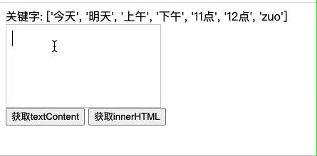

---
{
  "title": "输入过程中，怎么实时高亮部分文字(@xxx高亮实现)",
  "staticFileName": "highlight_when_input.html",
  "author": "guoqzuo",
  "createDate": "2020/09/07",
  "description": "输入过程中高亮部分文字,输入过程中高亮关键字,前端@高亮实现,输入过程中，怎么实时高亮部分文字(@xxx高亮实现)，实现思路是，使用富文本编辑器，当监听到输入的文件包含关键字时，使用replace对当前的输入内容进行替换，给关键字加上span给个highlight的class，代码如下",
  "keywords": "输入过程中高亮部分文字,输入过程中高亮关键字,前端@高亮实现",
  "category": "Vue"
}
---
# 输入过程中，怎么实时高亮部分文字(@xxx高亮实现)



实现思路是，使用富文本编辑器，当监听到输入的文件包含关键字时，使用replace对当前的输入内容进行替换，给关键字加上span给个highlight的class，代码如下
```html
<div id="editdiv" contenteditable></div>
<script>
  let editdiv = document.querySelector('#editdiv')
  // 输入内容改变
  editdiv.oninput = (e) => {
    let curValue = editdiv.innerHTML
    console.log('当前富文本输入内容', curValue)
    let needHighlightArr = keyArr.filter(item => curValue.includes(item))
    // 开始高亮
    needHighlightArr.forEach(item => {
      console.log(item, curValue)
      // 如果之前已经设置了highlight，就不设置了
      let nextText = `<span class="highlight">${item}</span>`
      if (!curValue.includes(nextText)) {
        curValue = curValue.replace(item, nextText)
      }
    })
    editdiv.innerHTML = curValue
  }
</script>
```

## 1.replace后，光标移动到了输入框最前面

```js
// 解决方法：replace后，把输入光标移动到最后面
// set 光标到末尾
// https://www.cnblogs.com/jonie-wong/p/5519822.html
// div输入@光标定位
// 知乎div编辑器，@功能的光标定位问题
// https://segmentfault.com/q/1010000005617160
function focusToElementEnd(el) {
  el.focus();
  if (!window.getSelection) {
    var range = document.selection.createRange();
    this.last = range;
    range.moveToElementText(el);
    range.select();
    document.selection.empty(); //取消选中
  }
  else {
    var range = document.createRange();
    range.selectNodeContents(el);
    range.collapse();
    var sel = window.getSelection();
    sel.removeAllRanges();
    sel.addRange(range);
  }
}
```

## 2.替换后虽然高亮了，但再次输入的文字，也会一直是高亮的
注意，后面输入的字母没有放到replace span后面
```js
// [Log] 当前富文本输入内容  "123zuo" 
// [Log] zuo "123zuo"
// [Log] 替换后，再次获取富文本输入内容 "123<span class="highlight">zuo</span>"

// [Log] 当前富文本输入内容 – "123<span class=\"highlight\">zuok</span>"
// [Log] zuo – "123<span class=\"highlight\">zuok</span>"
```
网上找了下，最相似的答案是 [实现动态输入关键字时关键字高亮](https://www.jianshu.com/p/b419a695d11b)，从这里捕捉到一个很重要的信息，就是里面提到的是替换text而不是html，而我替换的是innerHTML，所以我换了下思路

在onkeyup键盘抬起时对textContent进行replace，解决了这个问题

```js
const keyArr = ['今天', '明天', '上午', '下午', '11点', '12点', 'zuo']
let editdiv = document.querySelector('#editdiv')
editdiv.onkeyup = (e) => {
  console.log('onkeyup', e, editdiv.textContent)
  // document.execCommand('forecolor', false, 'black')
  let curValue = editdiv.textContent
  let needHighlightArr = keyArr.filter(item => curValue.includes(item))
  // 开始高亮
  needHighlightArr.forEach(item => {
    console.log(item, curValue)
    // 如果之前已经设置了highlight，就不设置了 class="highlight"
    let nextText = `<span class="highlight">${item}</span>`
    if (!curValue.includes(nextText)) {
      curValue = curValue.replace(item, nextText)
    }
  })
  editdiv.innerHTML = curValue
  focusToElementEnd(editdiv) // 将光标移动到末尾
}
```

## 3.输入法组合文件的过程中也会进行replace，中文无法输入
上面的demo还存在一个问题，就是在输入法组合文件的过程中也会进行replace，导致中文无法输入，这里我们结合之前研究[v-model无法实时监听输入法组合文字过程](http://www.zuo11.com/blog/2019/12/v_model_text.html)的经验。当组合文字时，不进行替换

```html
<div id="editdiv" contenteditable></div>
<button onclick="alert(document.querySelector('#editdiv').textContent)">获取textContent</button>
<button onclick="alert(document.querySelector('#editdiv').innerHTML)">获取innerHTML</button>
<script>
  const keyArr = ['今天', '明天', '上午', '下午', '11点', '12点', 'zuo']
  let composition = false // 是否是在输入法组合文字的过程中
  let editdiv = document.querySelector('#editdiv')

  editdiv.onkeyup = (e) => {
    console.log('输入法组合文字过程,composition: ', composition)
    if (composition) {
      return 
    }
    console.log('onkeyup', e, editdiv.textContent)
    
    let curValue = editdiv.textContent
    let needHighlightArr = keyArr.filter(item => curValue.includes(item))
    // 开始高亮
    needHighlightArr.forEach(item => {
      console.log(item, curValue)
      // 如果之前已经设置了highlight，就不设置了 class="highlight"
      let nextText = `<span class="highlight">${item}</span>`
      if (!curValue.includes(nextText)) {
        curValue = curValue.replace(item, nextText)
      }
    })
    editdiv.innerHTML = curValue
    focusToElementEnd(editdiv) // 将光标移动到末尾
  }

  editdiv.addEventListener('compositionstart', (e) => {
    console.log('oncompositionstart')
    composition = true
  });

  editdiv.addEventListener('compositionend',  (e) => {
    console.log('oncompositionend')
    composition = false
  });
</script>
```

以上，我们基本实现了输入过程中实时高亮关键字的功能，替换的细节还需要优化，这里只是一个实现思路。完整demo参见: [输入内容过程中高亮关键字 | github](https://github.com/dev-zuo/fedemo/blob/master/src/DebugDemo/%E8%BE%93%E5%85%A5%E5%86%85%E5%AE%B9%E8%BF%87%E7%A8%8B%E4%B8%AD%E9%AB%98%E4%BA%AE%E5%85%B3%E9%94%AE%E5%AD%97/index.html)
