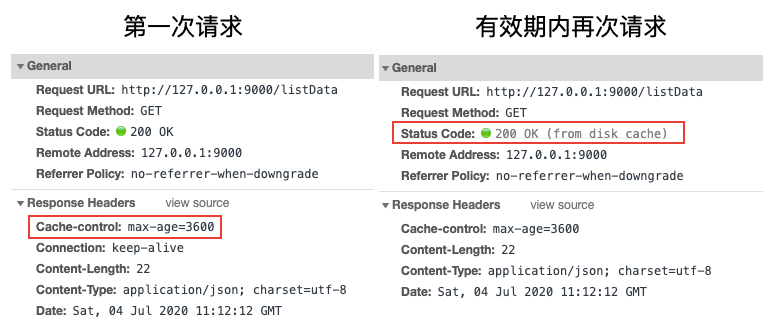

---
{
  "title": "通过koa写demo彻底理解前端http缓存",
  "staticFileName": "web_cache.html",
  "author": "guoqzuo",
  "createDate": "2020/09/07",
  "description": "http缓存,web缓存,前端缓存,强缓存,Expires,Cache-Control,弱缓存,协商缓存,sever revalidataion,Last-Modified/If-Modified-Since,ETag/if-None-Macth,在前端性能优化中，有一个方法是使用缓存。前端缓存可以减少网络请求次数，减少流量消耗，提升用户体验，降低服务器负载。前端缓存分为两种：http缓存、浏览器缓存。相关文档可以搜索对应请求头的MDN文档、另外可以参考《http权威指南》第7章 缓存",
  "keywords": "http缓存,web缓存,前端缓存,强缓存,Expires,Cache-Control,弱缓存,协商缓存,sever revalidataion,Last-Modified/If-Modified-Since,ETag/if-None-Macth",
  "category": "http与https"
}
---
# 通过koa写demo彻底理解前端http缓存
在前端性能优化中，有一个方法是使用缓存。前端缓存可以减少网络请求次数，减少流量消耗，提升用户体验，降低服务器负载。

前端缓存分为两种：http缓存、浏览器缓存，这里主要介绍http缓存

> 相关文档可以搜索对应请求头的MDN文档、另外可以参考《http权威指南》第7章 缓存

http缓存策略的核心在于**新鲜度检测**，一般有两种策略来保持已缓存数据与服务器数据之间的充分一致
1. 强缓存 - 设置文档过期时间(document expiration)：给当前请求设置一个过期时间，这段时间内可以直接使用缓存数据，不必再去请求服务器拿数据
2. 弱缓存/协商缓存 - 服务器再验证(server revalidation)：服务器响应某个请求时，在响应头加一个版本信息或最后一次修改时间的标记，当下次该请求发生时，请求头会携带这个标记信息，服务器会通过标记值来判断是否使用缓存内容

## 强缓存 document expiration
当第一次发送某个http请求后，会把内容缓存一段时间。在这段时间里，都认为内容是 "新鲜的"，可以在不联系服务器的情况下，直接响应该文档。

### Expires(相对时间)

Expires [ɪk'spaɪəz] 响应头包含日期/时间， 即在此时候之后，响应过期。无效的日期，比如 0, 代表着过去的日期，即该资源已经过期。如果在Cache-Control响应头设置了 "max-age" 或者 "s-max-age" 指令，那么 Expires 头会被忽略。

我们来写个demo试试，我们用koa来写个listData接口，将接口的Expires时间设置为当前时间+1小时，也就是一个小时后失效，koa代码如下
```js
const Koa = require('koa')
const Router = require('koa-router')
const app = new Koa()
const router = new Router()

app.use(require('koa-static')(__dirname + '/public'))

router.get('/listData', ctx => {
  // 打印log，用来看服务端是否收到了请求
  console.log('recive req', ctx.url)
  // 实际效果：Expires: Sat Jul 04 2020 19:28:42 GMT+0800 (GMT+08:00)
  ctx.set('Expires', new Date(+new Date() + 3600 * 1000)) // UTC时间
  ctx.body = {
    info: 'hello world'
  }
})

app.use(router.routes()).use(router.allowedMethods())
app.listen(9000, () => {
  console.log('server start on 9000 port')
})
```
前端测试demo：public/index.html如下
```html
<body>
  <div> 
    <button id="btn">发送请求</button>
  </div>
  <script src="https://cdn.jsdelivr.net/npm/axios/dist/axios.min.js"></script>
  <script>
    let btn = document.getElementById('btn')
    btn.onclick = () => {
      sendRequest()
    }

    async function sendRequest() {
      try {
        let res = await  axios.get('/listData');
        console.log(res)
      } catch(e) {
        console.log(e)
      }
    }
  </script>
</body>
```
当我们点击两次发送请求，测试结果如下：第一次请求时正常接收请求，由于我们设置了Expires响应头，前端再次请求时，服务端没有接收到请求，浏览器直接从硬盘读的缓存(from disk cache)，响应头对比图如下


参考：[Expires - HTTP | MDN](https://developer.mozilla.org/zh-CN/docs/Web/HTTP/Headers/Expires)

### Cache-Control

Expries是http1.0的标准，在HTTP/1.1版本里，Expire已经被Cache-Control替代，除了可以设置时间外，还加了更多控制，Cache-Control可以设置很多值

可缓存性相关值
- public：所有内容都将被缓存（客户端和代理服务器都可缓存）
- private：所有内容只有客户端可以缓存，（即代理服务器不能缓存它）Cache-Control的默认取值
- no-cache：客户端缓存内容，但是是否使用缓存则需要经过协商缓存来验证决定（除非资源进行了再验证(协商缓存验证)，否则客户端不会使用已换成的资源）
- no-store：所有内容都不会被缓存，即不使用强制缓存，也不使用协商缓存（缓存应当尽快从服务器中删除文档的所有痕迹，因为其中可能包含敏感信息）

到期相关值
- max-age=seconds 设置缓存存储的最大周期，超过这个时间缓存被认为过期(单位秒)。与Expires相反，时间是相对于请求的时间。
- s-maxage=seconds 覆盖max-age或者Expires头，但是仅适用于共享缓存(比如各个代理)，私有缓存会忽略它。

我们将上个例子中设置Expires替换为Cache-Control的写法
```js
ctx.set("Cache-control", "max-age=3600")  // 设置缓存有效时间为3600s，1个小时
```
执行结果和之前的基本一致，只是响应头有点变化，如下图



这里要特别注意，Catch-Control不止响应头可以设置，前端在请求头也是可以设置的
```bash
Cache-Control: max-age=<seconds> # 如果后端不设置改值，前端无效
Cache-Control: max-stale[=<seconds>]
Cache-Control: min-fresh=<seconds>
Cache-control: no-cache  # 可以使用，等价于 Pragma: no-cache
Cache-control: no-store
Cache-control: no-transform
Cache-control: only-if-cached
```
我们可以在axios请求时加请求头参数
```js
let res = await  axios.get('/listData', {
  headers: {'Cache-Control': 'no-cache'}, // 如果前端使用这个请求头，那么后端设置的max-age或Expires就会被忽略
});
```
参考：[Cache-Control - HTTP | MDN](https://developer.mozilla.org/zh-CN/docs/Web/HTTP/Headers/Cache-Control)

## 弱缓存/协商缓存 server revalidation
直接给某个请求设置缓存有效期是简单粗暴的方法，因为一般我们无法准确的知道需要缓存的资源具体可能会变动的时间。于是就有了服务器再验证的这种策略，注意下面讨论的是get请求，涉及到304状态码，对于412相关的post参见具体的mdn文档


### Last-Modified/If-Modified-Since
在响应某个请求时，响应头加一个Last-Modified，值设置为某个资源的最后一次修改时间。注意：这里会有一个问题，加了Last-Modified后，下次请求浏览器直接使用了强缓存，直接读disk cache，没有请求服务器，那我们服务器再验证就验证不了，所以需要设置一个no-cache的请求头，不使用强缓存，代码如下：
```js
let fileInfo = fs.statSync('./public/index.html')
let mtime = fileInfo.mtime
ctx.set("Cache-control","no-cache");
ctx.set("Last-Modified", mtime)
```
这样设置后，下次请求时，请求头会自动携带If-Modified-Since，值为之前响应头设置的Last-Modified的值，然后我们根据If-Modified-Since请求头的时间，与某个文件修改的时间进行比对，如果相等，直接返回304状态码，浏览器会使用该接口上一次接口的缓存的数据
```js
// 完整接口如下
router.get('/listData', ctx => {
  console.log('recive req', ctx.url)
  let fileInfo = fs.statSync('./public/index.html')
  let mtime = fileInfo.mtime
  // console.log(fileInfo, fileInfo.mtime)
  // 响应头设置后，下次这个请求会在请求头自动加上 If-Modified-Since: Sat Jul 04 2020 21:19:30 GMT+0800 (GMT+08:00) 字段
  console.log(ctx.headers)
  ctx.set("Cache-control","no-cache");
  ctx.set("Last-Modified", mtime)
  if (ctx.headers['if-modified-since'] && ctx.headers['if-modified-since'] == mtime) {
    console.log("304");
    ctx.status = 304
  } else {
    ctx.body = {
      info: 'hello world'
    }
  }
})
```

注意：**当与 If-None-Match 一同出现时，它（If-Modified-Since）会被忽略掉，除非服务器不支持 If-None-Match。**

参考：
- [Last-Modified - HTTP | MDN](https://developer.mozilla.org/zh-CN/docs/Web/HTTP/Headers/Last-Modified)
- [If-Modified-Since - HTTP | MDN](https://developer.mozilla.org/zh-CN/docs/Web/HTTP/Headers/If-Modified-Since)

### ETag/if-None-Macth

有些请求验证最后修改时间是不够的，比如：
- 某些文件会被周期性的重写，但文件内容是一样的，可最后一次修改时间变了
- 有些文档被改了，但改动并不重要，比如拼写或注释的修改，不需要让所有缓存都更新
- 有些文档会在亚秒间发生变化，对设置服务器来说，1s的粒度会不够用

因此，Last-Modified由于精确度比ETag(实体标签)要低，所以Last-Modified只是一个备用机制。一般Last-Modified设置的是修改时间，而ETag设置的一般是某个资源的标识符(版本号或者md5，表示一个文件的指纹fingerprints)，来看代码
```js
const calcMd5 = require('./md5')
router.get('/listData', (ctx, next) => {
  console.log('recive req', ctx.url)
  let md5 =  calcMd5('./public/index.html')
  ctx.set("Cache-control","no-cache");
  ctx.set('ETag', md5)
  if (ctx.headers['if-none-match'] && ctx.headers['if-none-match'] === md5) {
    console.log("304");
    ctx.status = 304
  } else {
    ctx.body = {
      info: 'hello world'
    }
  }
})
```
md5.js 计算文件md5
```js
const crypto = require('crypto');
const fs = require('fs');

module.exports = (filePath) => {
	//读取一个Buffer
	let buffer = fs.readFileSync(filePath);
	let fsHash = crypto.createHash('md5');

	fsHash.update(buffer);
	return fsHash.digest('hex');
}
```

参考:
- [ETag - HTTP | MDN](https://developer.mozilla.org/en-US/docs/Web/HTTP/Headers/ETag) 
- [If-None-Match - HTTP| MDN](https://developer.mozilla.org/en-US/docs/Web/HTTP/Headers/If-None-Match)

## Chrome下注意事项
在进行缓存测试时，你会发现浏览器的真实情况和书上或文档里的会有一点不一样的地方，我们需要注意：
1. **如果ETag和If-None-Match的值一致，且koa返回了304，但前端一直是200时，可能是浏览器的问题，关掉浏览器当前页面，再打开可能就好了**。这一块调的我差点怀疑人生
2. **书上或文档里说，no-cache只是不使用强缓存，需要服务器二次验证、而no-store是既不使用强缓存也不使用协商缓存，但是在chrome浏览器里，如果你的请求头里有Cache-Control': 'no-cache'，不管是强缓存还是协商缓存都不会生效；**
3. **在F12 chrome调试面板，勾选disable cache，请求头会自动携带Pragma: no-cache，等价于请求头里设置cache-control： no-cache**
4. **在chrome浏览器下，请求头里使用Cache-Control': 'no-store'，没有任何用处**

关于以上完整的HTTP缓存测试demo，参见 [http缓存测试 | github](https://github.com/zuoxiaobai/fedemo/tree/master/src/DebugDemo/%E5%89%8D%E7%AB%AF%E7%BC%93%E5%AD%98)

参考:
- [Pragma - HTTP | MDN](https://developer.mozilla.org/zh-TW/docs/Web/HTTP/Headers/Pragma)
