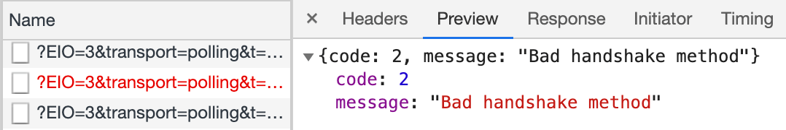
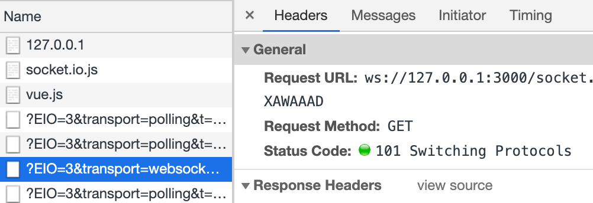

---
{
  "title": "socket 'Bad handshake method' 400",
  "staticFileName": "socket-400.html",
  "author": "guoqzuo",
  "createDate": "2021/01/12",
  "description": "在使用 socket.io 测试 scoket 功能时，发现之前都运行正常的 demo 突然就无法正常运行了。接口返回 400 Bad Request，响应信息为 { code: 2, message: 'Bad handshake method' } 后来发现是版本的问题，前端页面引入的 socket.io 版本是 `2.3.0`，通过 npm install 默认安装的 socket.io 版本是 `3.0.4`，将 koa 里面的 npm 包降到  2.3.0 就正常了",
  "keywords": "socket.io 400,Bad handshake method",
  "category": "JavaScript"
}
---
# socket "Bad handshake method" 400
在使用 socket.io 测试 scoket 功能时，发现之前都运行正常的 demo 突然就无法正常运行了。接口返回 400 Bad Request，响应信息为 { code: 2, message: "Bad handshake method" }



后来发现是版本的问题，前端页面引入的 socket.io 版本是 `2.3.0`，通过 npm install 默认安装的 socket.io 版本是 `3.0.4`，将 koa 里面的 npm 包降到  2.3.0 就正常了
```bash
npm uninstall socket.io --save;
npm install socket.io@2.3.0 --save;
```

