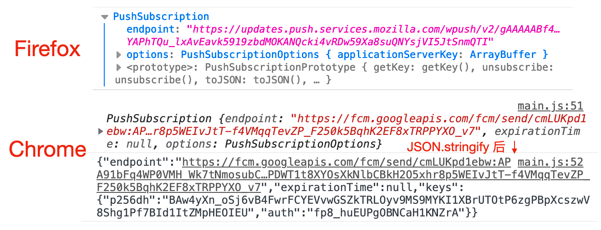

---
{
  "title": "使用 Service Worker 接收服务器推送消息并显示通知",
  "staticFileName": "sw-notification.html",
  "author": "guoqzuo",
  "createDate": "2021/01/12",
  "description": "推送通知一般需要支持服务器推送，在常规网页中是不可能的。service worker 可以实现该行为 - service worker 可以显示通知 - service worker 可以处理这些通知的交互 - service worker 能够订阅服务器发送的推送通知 - service worker 能够处理推送消息，即使应用没有在前台运行或者根本没打开",
  "keywords": "service worker接收服务器推送消息",
  "category": "JavaScript"
}
---
# 使用 Service Worker 接收服务器推送消息并显示通知
推送通知一般需要支持服务器推送，在常规网页中是不可能的。service worker 可以实现该行为
- service worker 可以显示通知
- service worker 可以处理这些通知的交互
- service worker 能够订阅服务器发送的推送通知
- service worker 能够处理推送消息，即使应用没有在前台运行或者根本没打开


## 1. 显示通知

在 service worker 中可以使用 ServcieWorkerRegistration 对象支持 showNotifications() 方法来显示通知，可以配置 title 和 options 配置
```js
navigator.serviceWorker.register('./serviceWorker.js')
  .then((registration) => {
    Notification.requestPermission()
      .then(status => {
        if (status === 'granted') {
          registration.showNotification('title')
        }
      })
  })
```
在 serviceWorker.js 中使用 self.registration 也可以显示通知
```js
// 注意 onactivate 默认只触发一次
self.onactivate = () => self.registration.showNotification('bar')
```

## 2. 处理通知事件

ServiceWorkerRegistration 对象创建的通知会向 service worker 发送 notificationclick 和 notificationclose 事件
```js
self.onnotificationclick = (event) => {
  // NotificationEvent {}, Notification {}
  console.log('notification click', event, event.notification)
  // 点击通知后，在新的 tab 打开网页
  clients.openWindow('http://www.zuo11.com')
}
self.onnotificationclose = (event) => {
  console.log('notification close', event, event.notification)
}
```

## 3.订阅推送事件

使用 registration.pushManager.subscribe() 可以对服务器推送消息发起订阅。注意这个过程中不会发送请求到我们的应用服务器。该函数包含两个参数：
- `userVisibleOnly` 通常被设置为 true，用来表示后续信息是否展示给用户。
- `applicationServerKey` 秘钥，类型为 Uint8Array，用于加密服务端的推送信息，防止中间人攻击，会话被攻击者篡改。测试时，可以通过 [web-push-codelab](https://web-push-codelab.glitch.me/) 网站获取秘钥并验证全流程，将该网站随机生产的 Application Server Keys 中的 Public Key 使用 urlBase64ToUint8Array() 转换后即可当做 applicationServerKey 使用

urlBase64ToUint8Array() 函数代码
```js
function urlBase64ToUint8Array(base64String) {
  const padding = '='.repeat((4 - base64String.length % 4) % 4);
  const base64 = (base64String + padding)
    .replace(/-/g, '+')
    .replace(/_/g, '/');

  const rawData = window.atob(base64);
  const outputArray = new Uint8Array(rawData.length);

  for (let i = 0; i < rawData.length; ++i) {
    outputArray[i] = rawData.charCodeAt(i);
  }
  return outputArray;
}
```
**registration.pushManager.subscribe() 函数返回一个 Promise，resolve 为 PushSubscription 对象，该对象包含服务器推送时必要的信息** 不同的浏览器，对应的 endpoint 不一样。Chrome 和 Firefox 会不一样，如下图




**如果一直卡在 registration.pushManager.subscribe()，不向下执行，状态一直时 pending，可能是因为 Chrome 浏览器关于推送消息的功能，被墙了，需要科学上网才能正常返回**

订阅代码如下：
```js
// main.js
(async () => {
  try {
    const registration = await navigator.serviceWorker.register("sw.js");
    const status = await Notification.requestPermission()
    if (status === 'granted') {
      const vapidPublicKey = 'BF9WWlvQiKSOwziO4gVeBdMeuhDW2HU2aCWAmaSLgXqGCGZK3ho15l30oQ6pdavh8acsc1kiXJNK-DtaqbHaZCQ';
      const convertedVapidKey = urlBase64ToUint8Array(vapidPublicKey);
      // 防止 DOMException: Failed to execute 'subscribe' on 'PushManager': Subscription failed - no active Service Worker
      if (!registration.active) {
        // 等待变为激活状态
        await new Promise(r => setTimeout(r, 500))
      }
      const pushSubscription = await registration.pushManager.subscribe({
        applicationServerKey: convertedVapidKey, // 来自服务器的公钥
        userVisibleOnly: true
      });
      console.log(pushSubscription) // PushSubscription
      console.log(JSON.stringify(pushSubscription)) // 这个消息可用于服务端发起推送
      // { 
      //   "endpoint": "https://fcm.googleapis.com/fcm/send/ecbqKLEnhB8:APA91bGvTW0x3k57bT9gDMLPPVkwLotGJyqJ1kk8yvNHyNAJ8Z0F6O74BuA8QxVNPIsgf1gWlGrUe0bYSs4L6fo-Fl18WkwGyHc3FEo2YvSUXBr5AA7KenaZBkL1D87WuAE7ERl-JCM4",
      //   "expirationTime": null, 
      //   "keys": { 
      //     "p256dh": "BIpKDNOPNQcBnfJVmdtZM2eJ0qS-FjicsiZK8jyUU07lGREwM_VZe2ulIWdrdlNlg7RFnHge8vJSe5y6TagW3Oc",
      //     "auth": "IlAite8VLBLWV5ubUXg91w"
      //   }
      // }
    }
  } catch (err) {
    console.log(err);
  }
})()
```
上面的例子中，成功拿到 JSON.stringify(pushSubscription) 后，就可以在服务端使用该信息进行推送通知了。

## 4.处理服务端推送消息
```js
// sw.js
// 当接收到服务端推送的消息时
self.onpush = pushEvent => {
  // 服务器推送的消息文本
  console.log(pushEvent.data.text())
  // 保持 service worker 活动到显示通知 resolve
  pushEvent.waitUntil(
    // 将服务器推送的消息作为通知显示
    self.registration.showNotification(pushEvent.data.text())
  )
}
// 点击消息时
self.onnotificationclick = (event) => {
  // NotificationEvent {}, Notification {}
  console.log('notification click', event, event.notification)
  // 点击通知后，在新的 tab 打开网页
  clients.openWindow('http://www.zuo11.com')
}
```

现在来测试下，上面的例子中，我们使用 [web-push-codelab](https://web-push-codelab.glitch.me/) 网站获取了 applicationServerKey 秘钥，我们同样可以在该网站发起服务端消息推送。将之前我们获取的 JSON.stringify(pushSubscription) 字符串拷贝到该网站的 Subscription to Send To 那一栏，然后在 Text to Send 中填写需要推送的消息。再点击 Send Push Message 按钮即可进行服务器推送。

这样就可以看到通知了。上面只是为了方便测试，如果需要使用程序化的方式来进行服务端推送，那就需要把 JSON.stringify(pushSubscription) 字符串传到后端，以 Node.js 为例，后端可以使用 [web-push](https://github.com/web-push-libs/web-push) 来进行服务端推送。

参考：
- [Service Worker学习与实践（三）——消息推送 - 知乎](https://zhuanlan.zhihu.com/p/57225424)
- [Service Worker学习与实践（三）——消息推送 - CSDN](https://blog.csdn.net/weixin_33841722/article/details/88731760)
- [Push API - W3C Editor's Draft 07 October 2020](https://w3c.github.io/push-api/#widl-PushManager-subscribe-Promise-PushSubscription--PushSubscriptionOptions-options)