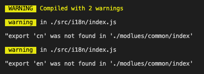

---
{
  "title": "import { } 解构与 export 和 export default",
  "staticFileName": "import_export.html",
  "author": "guoqzuo",
  "createDate": "2021/04/03",
  "description": "在封装功能函数时，我们经常需要在 import 时使用解构 {} 来仅导出部分模块功能。在有些情况会发现是无法解构的，下面来看看 - 一般 export default 的内容，需要使用 `import xxx from 'xx'` 直接接收，不能在 import 时解构 - 通过 export xx 的内容，需要使用 `import { xx, xx } from 'xx'` 或 `import * as xx from 'xx'` 接收",
  "keywords": "import {} 与 export default,import {}",
  "category": "JavaScript"
}
---
# import { } 解构与 export 和 export default.md

在封装功能函数时，我们经常需要在 import 时使用解构 {} 来仅导出部分模块功能。在有些情况会发现是无法解构的，下面来看看
```js
// ./modlues/common/index
export default {
  en: {
    msg: 'hello',
  },
  cn: {
    msg: '你好',
  },
}

// index.js
import { en, cn } from './modlues/common/index'
console.log(en, cn)
```



这里是无法解构的，提示警告，需要写成这样
```js
import common from './modlues/common/index'
let { en, cn } = common
console.log(en, cn)
```
如果是需要在 import 时就能解构，需要使用下面的写法
```js
// ./modlues/common/index
export const en = {
  msg: 'hello',
}

export const cn = {
  msg: '你好',
}
```
或者
```js
const en = {
  msg: 'hello',
}
const cn = {
  msg: '你好',
}
export { en, cn }
```

- 一般 export default 的内容，需要使用 `import xxx from 'xx'` 直接接收，不能在 import 时解构
- 通过 export xx 的内容，需要使用 `import { xx, xx } from 'xx'` 或 `import * as xx from 'xx'` 接收

参考: [详解ES6 export default 和 import语句中的解构赋值](https://www.jb51.net/article/162079.htm)