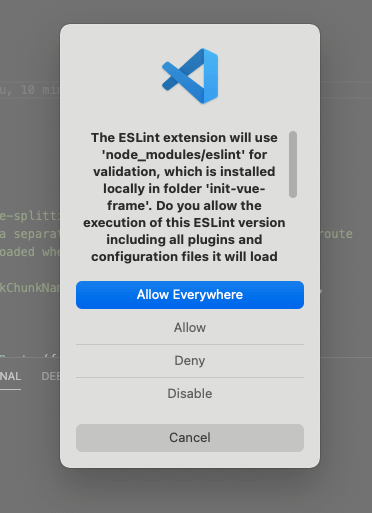

---
{
  "title": "import 出现黄色警告提示，ESLint is disabled since its execution has not been approved",
  "staticFileName": "eslint_auth.html",
  "author": "guoqzuo",
  "createDate": "2021/04/03",
  "description": "在有 ESLint 的项目中，发现 import 都出现了黄色警告，提示 ESLint is disabled since its execution has not been approved or denied yet. Use the light bulb menu to open the approval dialog.eslint。这是因为初次打开项目，没有 eslint 授权产生的错误提示。点击 vscode 开发工具右下角的 ESLint 就会弹出授权窗口，点击允许即可。",
  "keywords": "ESLint 授权弹窗,eslint auth dialog",
  "category": "计算机基础与开发工具"
}
---
# import 出现黄色警告提示，ESLint is disabled since its execution has not been approved

在有 ESLint 的项目中，发现 import 都出现了黄色警告，提示 ESLint is disabled since its execution has not been approved or denied yet. Use the light bulb menu to open the approval dialog.eslint

这是因为初次打开项目，没有 eslint 授权产生的错误提示。点击 vscode 开发工具右下角的 ESLint 就会弹出授权窗口，点击允许即可。

