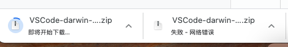
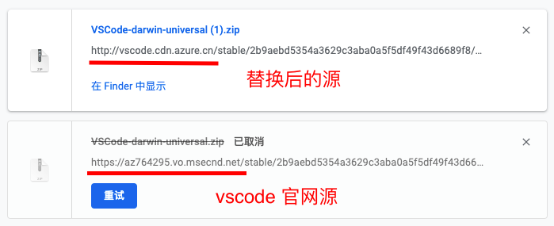

# vscode 下载太慢，vscode 官网下载太慢解决方法

在 vscode 官网下载 vscode 时，发现非常慢，过会儿就下载失败了。如下图

为了解决这个问题，我们可以在下载中，找到对应的下载链接将 url 前面的域名修改为其他源，这样下载会很快。如下图

将 vscode 官网默认下载 url 前面的路径改为 `vscode.cdn.azure.cn` 即可

参考: [国内下载vscode速度慢问题解决 - 知乎](https://zhuanlan.zhihu.com/p/112215618)