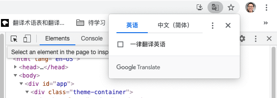
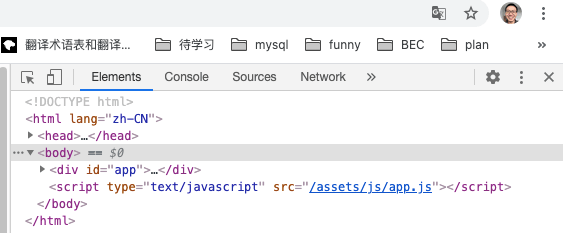

# vuepress html lang 默认为英文，总是弹出 google 翻译怎么解决

默认情况下，vuepress 生成的网页 html lang 属性为 "en-US"，当在 Chrome 浏览器打开时，总是会弹出翻译的窗口。如下图



解决这个问题的方法就是将默认的 lang 设置为中文 "zh-CN" 即可。vuepress 支持国际化功能，我们只需要修改下对应的配置即可。

```js
// .vuepress/config.js
module.exports = {
  title: '左小白的前端笔记',
  // 国际化相关
  locales: {
    // 键名是该语言所属的子路径
    // 作为特例，默认语言可以使用 '/' 作为其路径。
    '/': {
      lang: 'zh-CN', // 将会被设置为 <html> 的 lang 属性
    }
  },
  // ...
}
```
修改后的效果如下图，lang 修改了，就不会弹翻译的窗口了

