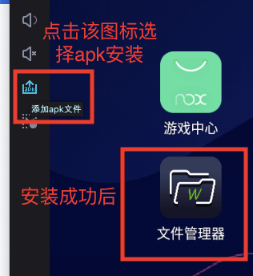
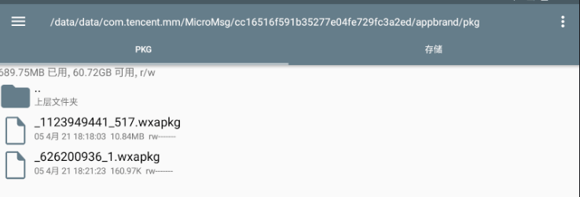
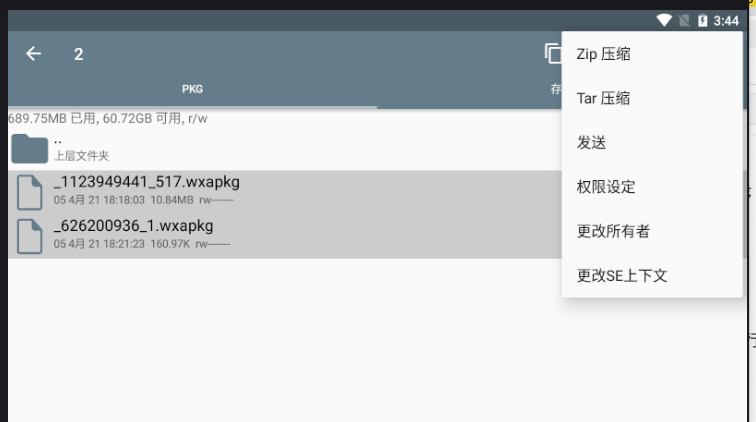
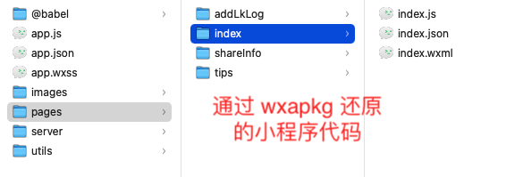
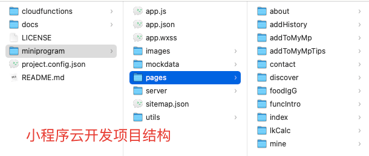
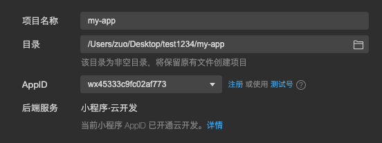
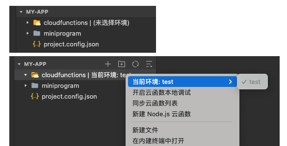
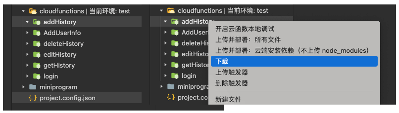
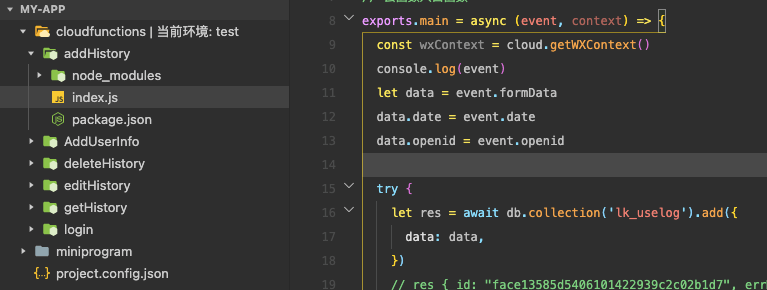

# 小程序代码找回，代码丢失后找回过程记录（反编译、云开发函数恢复）

最近想把之前写的一个已上线的小程序开源，发现当时居然没有用 git 管理，换电脑、折腾 mac 双系统后，代码丢失了。尝试用数据恢复软件恢复都没有找回代码，尽管小程序的文件特征很好找，比如 .wxml、project.config.json 等。

后面在网上找了反编译线上小程序的方法。这样可以拿到 uglify 混淆压缩后的代码，至少比没有强。另外，云函数的代码也是可以恢复的，因为之前开发时上传过，它是可以下载的。

> 注意：反编译小程序要求必须是已上线的小程序。对于云函数的恢复/下载，需要知道之前开发的 appid，且微信账号拥有对应的管理员/开发权限。

## 为什么小程序可以反编译？

理论上小程序也是属于前端代码，前端的 js、css、html 一般是可以拿到的。微信在打开小程序时，会先下载对应小程序的包(.wxapkg文件)来执行。只要我们拿到这个文件，就可以通过反编译拿到混淆压缩后的代码。这里反编译使用的是 [wxappUnpacker](https://github.com/qwerty472123/wxappUnpacker)，虽然删除了，但点开 fork，有很多之前备份的代码。 

## 获取小程序的 wxapkg 文件

1. 下载安装 [夜神模拟器](https://www.yeshen.com/)，注意：如果是 mac 系统，打开后一直卡在 99%，可能是因为 VirtualBox 的原因，安装该模拟器时，会自动安装 VirtualBox，可以在 app 中手动打开 VirtualBox 并启动，再打开模拟器。
2. 下载 [RE 文件管理器](http://www.pc6.com/az/56118.html)，文件名为：com.speedsoftware.rootexplorer_999496.apk
3. 在 模拟器中 安装 RE文件管理器，点击模拟器右侧的 添加 apk 文件图标，选择刚才下好的 apk 文件进行安装。如下图，安装完成后打开该 app，并允许获取权限。



4. 在模拟器中搜索 微信，安装好后，运行微信，登录后，打开对应的小程序
5. 打开小程序后，在文件管理器的 `/data/data/com.tencent.mm/MicroMsg/{数字串}/appbrand/pkg/` 目录，可以看到对应的 .wxapkg 文件，如下图。注意：如果找不到对应的文件，可以点击右上角的三个点，搜索对应的文件。



6. 导出 .wxapkg 文件。鼠标长按对应的文件，多选两个 wxapkg 文件，点击右上角三个点，zip 压缩，压缩后，查看对应的文件，再点击右上角三个点，发送到微信即可。 



## 使用 wxappUnpacker 反编译 wxapkg 文件

拿到小程序的 wxapkg 文件后，我们将之前在 fork 仓库中下载好的 wxappUnpacker 在 vscode 中打开，使用 Terminal cd（进入）到对应的目录。运行 npm install 或 yarn add 安装对应的依赖。安装完成后，在当前目录下，运行 `node wuWxapkg.js 对应的小程序wxapkg文件` 命令，就可以得到反编译后的代码。
```bash
# 安装依赖
npm install css-tree cssbeautify escodegen esprima js-beautify uglify-es vm2
# 还原小程序代码示例
node wuWxapkg.js '/Users/zuo/Desktop/test1234/_626200936_1.wxapkg'
```

运行后，虽然生成了代码，但是 terminal 出现了下面的错误，css 文件未被还原

```js
/wxappUnpacker-master/node_modules/vm2/lib/main.js:890
                                throw this._internal.Decontextify.value(e);
                                ^
ReferenceError [Error]: __vd_version_info__ is not defined
```

这里需要修改 wxappUnpacker 项目中 wuWxss.js 中的 runOnce() 函数代码
```js
// wuWxss.js
// function runOnce(){
// 	for(let name in runList)runVM(name,runList[name]);
// }
function runOnce() {
  for (let name in runList) {
    // console.log(name, runList[name]);
    var start = `var window = window || {}; var __pageFrameStartTime__ = Date.now(); var __webviewId__; var __wxAppCode__={}; var __mainPageFrameReady__ = function(){}; var __WXML_GLOBAL__={entrys:{},defines:{},modules:{},ops:[],wxs_nf_init:undefined,total_ops:0}; var __vd_version_info__=__vd_version_info__||{};
    
    $gwx=function(path,global){
    
    if(typeof global === 'undefined') global={};if(typeof __WXML_GLOBAL__ === 'undefined') {__WXML_GLOBAL__={};
    
    }__WXML_GLOBAL__.modules = __WXML_GLOBAL__.modules || {};
    
    }`;
    runVM(name, start + " \r\n" + runList[name]);
  }
}
```

修改后再次执行就 OK 了，代码大致就恢复了。目录结构如下




## 小程序云开发，云函数代码恢复

> 理论上云开发和小程序 appid，微信号开发权限是相关联的，如果没有权限是无法还原云函数的

这个项目是小程序云开发的项目，而 wxappUnpacker 恢复的只是普通小程序的目录结构。下面是小程序云开发的目录结构



我们需要进一步处理
1. 创建一个新的文件夹，比如 my-app，然后在目录下创建 cloudfunctions 和 miniprogram 文件夹，将恢复的代码，拷贝到 miniprogram 中
2. 创建 project.config.json 文件，找到之前开发该小程序时，使用的该小程序的 appid，修改 project.config.json 文件

```js
{
  "miniprogramRoot": "miniprogram/",
  "cloudfunctionRoot": "cloudfunctions/",
  "appid": "wx45333c9fc02af773",
  "projectname": "my-app"
}
```
3. 打开微信小程序开发工具，选择导入项目，选择 my-app 目录，即可打开项目，如下图



由于我们之前创建过云开发环境，因此我们右键 cloudfunctions 目录，可以选择当前环境比如 test。这时 cloudfunctions 是空的，可以右键后，选择同步云函数列表



同步后，cloudfunctions 目录下就会创建之前的云函数文件夹，如下图，右键对应的云函数文件夹，选择下载，即可下载对应云函数的代码。



云函数代码，不是混淆压缩的，是 100% 还原的，如下图



自此，项目就大致还原了。美中不足的是，样式没有恢复完全，另外 js 都是混淆压缩后的代码，需要慢慢修改还原。

不过项目还是可以跑起来的，比完全丢失了好，还原后的该小程序已开源，后面会慢慢修复还原混淆压缩后的代码。开源地址：[remicade-record - github](https://github.com/ibdlib/remicade-record)

参考: 
- [小程序源码丢失了怎么在微信平台反编译找回](https://blog.csdn.net/qq_38822390/article/details/82152004)
- [最新解决小程序反编译$gwx is not defined和__vd_version_info__ is not defined](https://www.jianshu.com/p/83b9e7d3ded4)
- [2020微信小程序反编译（逆向），仅用于学习请勿商用](https://www.cnblogs.com/yeahwell/p/13546770.html)
