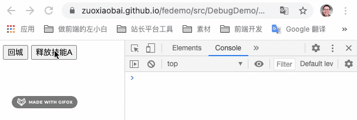

# 用游戏中的场景理解节流与防抖，最简单的 js 实现

之前对节流(throttle) 和防抖（debounce）的理解有偏差，以为 ~~scroll 或 resize 时，为了减少执行事件函数频率，需要用节流，减少执行次数。而防抖在于点击某个按钮后，多长时间内不允许再次点击。防止多次重复提交表单，或执行下一步函数。~~

这种理解是反的。我们可以用游戏的中的场景来理解节流和防抖

## 节流(throttle)

对应 **技能冷却时间**，如果冷却(cooldown/cd)是 5 秒，使用技能后，5秒内，无法再次执行。用于控制事件执行一次后，多长时间内不允许再次执行。一般用于防止按钮多次点击，重复触发事件。



来实现节流的功能，比较好的实现是，创建一个可复用的节流函数，它可以将普通函数转换为增加了节流功能的函数，基本结构如下
```js
/**
 * throttle
 * @param { Function } func 执行函数
 * @param { Interger } time 多长时间内不能第二次执行
 * @returns function 返回经过节流处理的函数
 */
function throttle(func, time) {
  return function (...args) {
    // 返回一个可以正常执行的函数
    func.apply(this, args)
  }
}
```
在基本的机构中，增加节流控制处理
```js
/**
 * throttle
 * @param { Function } func 执行函数
 * @param { Interger } time 多长时间内不能第二次执行
 * @returns function 返回经过节流处理的函数
 */
function throttle(func, time) {
  let isLock = false // 是否冷却(cooldown)中
  // 返回一个经过节流处理的 func
  return function (...args) {
    if (isLock) { // 如果是冷却中，不执行函数
      console.log('冷却(cd)中...')
      return 
    }
    // 非冷却中
    func.apply(this, args) // 执行函数
    isLock = true // 执行函数后设置为冷却中
    setTimeout(() => {
      isLock = false // 经过 time 微秒后，设置为非冷却中
    }, time);
  }
}
```

使用示例
```html
<button id="skillsABtn">释放技能A</button>
<script>
  let skillsABtn = document.querySelector('#skillsABtn')
  releaseASkills = () => {
    console.log(`释放A技能, ${+new Date()}`)
  }
  // 技能冷却时间 3 秒
  skillsABtn.onclick = throttle(releaseASkills, 3000)
</script>
```

## 防抖(去抖动 debounce、de + bounce)

对应 **回城**，在推塔游戏中，回城等待时间是 8 秒。可以理解为回城时，会开启一个定时任务，8 秒后执行完成回城的函数。

防抖/去抖动，就是在定时任务等待执行的时间内，如果再次触发发了函数，会取消上一次的定时任务，重新开始一个定时任务。这样可以**将一段时间内连续的多次触发转化为一次触发，单位时间内仅执行最后一次**。一般用于 window 的 scroll、resize 事件、搜索框输入搜索内容后实时查询接口等。

```js
function debounce(func, time) {
  let timer = null // 定时任务计时器
  // 返回一个经过防抖处理的 func
  return function (...args) {
    if (timer) {
      // 如果上一次定时任务还在等待执行的过程中，取消定时任务
      clearTimeout(timer)
      console.log('取消上一次的计时任务')
    }

    console.log(`重新开启定时任务，${time} 毫秒后真正执行`)
    timer = setTimeout(() => {
      func.apply(this, args)
    }, time);
  }
}
```
实例
```html
<button id="goBackBtn">回城</button>
<script>
  let goBackBtn = document.querySelector('#goBackBtn')
  goBack = () => {
    console.log(`成功回城, ${+new Date()}`)
  }
  // 3 秒之后回城
  goBackBtn.onclick = debounce(goBack, 3000) 
</script>
```

## 代码下载
完整 demo 示例代码：[节流和防抖实现 - fedemo | Github](https://github.com/zuoxiaobai/fedemo/tree/master/src/DebugDemo/%E8%8A%82%E6%B5%81%E5%92%8C%E9%98%B2%E6%8A%96%E5%AE%9E%E7%8E%B0)，在线示例 [节流与防抖简单实现 demo - 需要打开 console 看执行效果](https://zuoxiaobai.github.io/fedemo/src/DebugDemo/%E8%8A%82%E6%B5%81%E5%92%8C%E9%98%B2%E6%8A%96%E5%AE%9E%E7%8E%B0/#/)