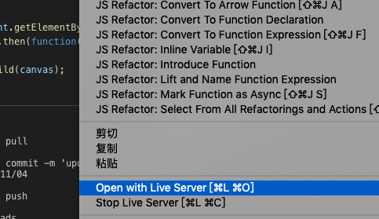
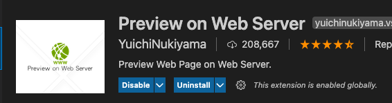
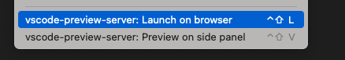

# Vscode Live Server 插件 Open With Live Server 没反应，无法打开浏览器

在调试单个 html 文件时，可以使用 Live Server 插件，快速开启 http 服务，并打开当前页面。

但目前这个插件可能会出现没反应，打不开的情况，可以使用 **Preview on Web Server** 来代替

使用方法基本一致，右键可以选择浏览器打开，或者在 vscode 侧边栏预览

