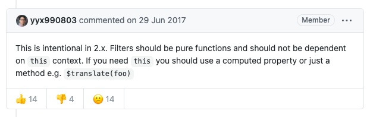

---
{
  "title": "Vue filters 中 this 为 undefined，建议使用传参或 method 处理",
  "staticFileName": "vue_filters_this.html",
  "author": "guoqzuo",
  "createDate": "2021/05/04",
  "description": "在 i18n 国际化，将 code 转换为国际化文本的场景中，需要使用 this.$i18n 这个变量，但发现 fitlers 中的 this 是 undefined，无法使用，查了下。这个是 Vue 设计问题，以下是作者 尤雨溪 在 issue [this undefined in filters · Issue #5998 · vuejs/vue](https://github.com/vuejs/vue/issues/5998) 下的回复：",
  "keywords": "vue filters this,vue filter this 为空,vue filter 不能使用 this",
  "category": "Vue"
}
---
# Vue filters 中 this 为 undefined，建议使用传参或 method 处理

在 i18n 国际化，将 code 转换为国际化文本的场景中，需要使用 this.$i18n 这个变量，但发现 fitlers 中的 this 是 undefined，无法使用，查了下。

这个是 Vue 设计问题，以下是作者 尤雨溪 在 issue [this undefined in filters · Issue #5998 · vuejs/vue](https://github.com/vuejs/vue/issues/5998) 下的回复：



This is intentional in 2.x. Filters should be pure functions and should not be dependent on this context. If you need this you should use a computed property or just a method e.g. $translate(foo)

在 2.x 的版本中这个处理是有意的，Fitlers 应该是纯函数，不应该依赖 this 上下文。如果需要依赖 this，那就应该使用 computed 计算属性或 method 方法

**解决方法：在 filters 中我们是可以传参数的，我们可以把需要的值，通过参数传入。如果涉及到多个变量的使用，传参比较冗余，那就使用计算属性或方法**，使用示例：

```js
// {{ currencyCode | currencyText($i18n) }}
filters: {
  currencyText: function(code, i18n) {
    // filter 中不能使用 this，需要传参数 this.$i18n
    // console.log(this); // undefined
    let { currencys, currencyCodes } = i18n.messages[i18n.locale].base;
    // 根据 code 找到对应的 index
    let index = currencyCodes.indexOf(code);
    return currencys[index];
  }
},
```

参考: [vue中过滤器filters的this指向问题。](https://blog.csdn.net/weixin_40837048/article/details/100691625)

