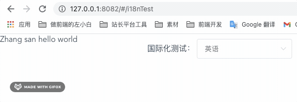
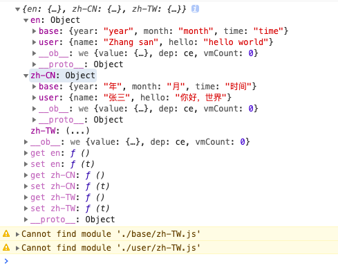

# Vue 国际化 vue-i18n 相关用法、实践总结

在 [Vue 使用 vue-i18n 国际化 - 左小白的技术日常](http://www.zuo11.com/blog/2021/4/vue_international.html) 中，我们简单介绍了 vue-i18n 的基本使用。如果想将它实际应用到项目中，我们还需要考虑怎么做到更加简洁、优雅、可维护，下面是一些实践总结。

## 1. i18n 单独放一个目录，避免在 main.js 中写入太多内容
i18n 相关内容较多，如果都写在 main.js 里，内容会很多，不够优雅，这里可以进行简单封装。在 src 目录下新建一个 i18n 目录，专门用于存放国际化相关内容，使用 index.js 作为入口文件
```js
// src/i18n/index.js
import Vue from "vue";
import VueI18n from "vue-i18n";

Vue.use(VueI18n);

const i18n = new VueI18n({
  locale: "zh-CN", // 设置默认语言环境
  // 在 vue template 的 {{}} 中，使用 $t('un') 即可拿到 un 属性指定的值
  // 不需要在 data() {} 中设置什么
  messages: {
    en: {
      name: "Zhang san",
      hello: "hello world"
    },
    "zh-CN": {
      name: "张三",
      hello: "你好，世界"
    }
  }
});

export default i18n; // 将 i18n 实例导出，用于在 new Vue 时引入
```
这样，我们在 main.js 就只需要修改两行就可以了
```js
// main.js
// ...
import i18n from "./i18n/index"; // 引入 src/i18n/index，得到 i18n 实例

new Vue({
  i18n, // 在 new Vue() 时加入 i18n
  router,
  store,
  render: h => h(App)
}).$mount("#app");
```

## 2. 方便实时测试：语言切换组件
在测试国际化时，改代码的方式切国际化语言不够方便。我们可以做一个测试用的语言切换组件，在主页面引入后，会出现在页面右上角，方便调试。相关配置存到 lcoalStorage 中，防止调试时刷新页面后需要再次手动切换语言。



```html
<!-- BaseLanguageSelect.vue -->
<template>
  <div class="demo-i18n">
    国际化测试：
    <el-select v-model="lang" @change="langChange">
      <el-option label="中文" value="zh-CN"></el-option>
      <el-option label="英语" value="en"></el-option>
    </el-select>
  </div>
</template>

<script>
// 将当前语言存到 localStorage 中的字段，要特殊，防止和其他项目冲突
const LANG_NAME = "demo-lang";
export default {
  data() {
    return {
      lang: "en"
    };
  },
  created() {
    // 从 localStorage 中读取默认语言，便于页面刷新后调试
    this.lang = localStorage.getItem(LANG_NAME) || "en";
    // 设置到 i18n
    this.$i18n.locale = this.lang;
  },
  methods: {
    // 语言切换后，设置到 i18n、localStorage
    langChange(value) {
      this.$i18n.locale = value;
      localStorage.setItem(LANG_NAME, value);
    }
  }
};
</script>

<style lang="less" scoped>
.demo-i18n {
  position: absolute;
  top: 10px;
  right: 10px;
}
</style>
```
使用示例
```html
<!-- i18nTest.vue -->
<template>
  <div>
    <BaseLanguageSelect />
    {{ $t("name") }}, {{ $t("hello") }}
  </div>
</template>

<script>
export default {
  components: {
    BaseLanguageSelect: () => import("./BaseLanguageSelect")
  }
};
</script>
```
## 3. 避免单文件过大、混乱：模块化
当项目较大、国际化内容较多时，如果将全部内容都写在 i18n/index.js 主文件中，有两个缺点：
- i18n/index.js 内容太多，不好查找
- 多人同时维护时，容易产生冲突，合并代码一不小心就会合出问题

这就需要模块化了，怎么优雅的模块化呢？下面是我的一些思考，仅供参考
- 按功能模块划分、不同的模块放到不同的目录、不同的语言使用不同的文件
- 新增模块和语言时，最小化改动公共文件 i18n/index.js

目录结构规划如下
```bash
├── i18n
│   ├── base # 通用模块，想用 common 但是使用时，模块名越短越方便，改为 base 
│   │   ├── en.js
│   │   └── zh-CN.js 
│   ├── user # 用户模块
│   │   ├── en.js
│   │   └── zh-CN.js 
│   ├── xxx # 其他模块
│   │   ├── en.js
│   │   └── zh-CN.js 
│   └── index.js # 入口文件、导出 i18n 实例
```
这里就需要重构 i18n/index.js 了，利用 import() 动态导入，使用 modules 模块数组，languages 语言数组，自动去合并、整理 messages。后面新增模块或新增语言非常方便、快捷，代码如下
```js
import Vue from "vue";
import VueI18n from "vue-i18n";

Vue.use(VueI18n);

/**
 * @description 根据模块、语言提取 messages
 * @author zuoxiaobai <i@zuoguoqing.com>
 * @param { Array } modules ["base", "user"]; // 模块数组
 * @param { Array } languages ["en", "zh-CN"]; // 语言数组
 * @returns { Object} messages
 */
function getMessages(modules, languages) {
  // 初始化 messages { en: {}, zh-CN: {}}
  let messages = {};
  languages.forEach(lang => {
    messages[lang] = {};
  });

  // 遍历模块，将内容添加到 messages.语言.上
  modules.forEach(moduleName => {
    languages.forEach(async lang => {
      // 加 try ... catch 防止语言文件缺失 import 报 error，影响执行
      try {
        let { default: obj } = await import("./" + `${moduleName}/${lang}.js`);
        // { en: { base: { } }, zh-CN: { base: {} }}
        !messages[lang][moduleName] && (messages[lang][moduleName] = {});
        Object.assign(messages[lang][moduleName], obj);
      } catch (e) {
        console.warn(e.message);
      }
    });
  });
  console.log(messages);
  return messages;
}

const modules = ["base", "user"]; // 模块数组
const languages = ["en", "zh-CN", "zh-TW"]; // 语言数组
let messages = getMessages(modules, languages);

const i18n = new VueI18n({
  locale: "zh-CN", // 设置默认语言环境
  messages
  // messages: {
  //   en: {
  //     name: "Zhang san",
  //     hello: "hello world"
  //   },
  //   "zh-CN": {
  //     name: "张三",
  //     hello: "你好，世界"
  //   }
  // }
});

export default i18n;
```
合并后的效果如下图，不同的模块放到不同的大对象上



在 vue 组件中使用时，加上模块前缀即可
```html
<template>
  <div>
    <BaseLanguageSelect />
    <!-- {{ $t("name") }}, {{ $t("hello") }} -->
    {{ $t("user.name") }}, {{ $t("user.hello") }}
    {{ $t("base.year") }}, {{ $t("base.month") }}, {{ $t("base.time") }}
  </div>
</template>
```

## 4. 列表渲染（code 值）处理：js 取值、过滤器 filter 设计
对于列表相关国际化，如果是前端纯展示还好，我们直接遍历即可，以 currency 币种为例，纯展示可以像下面这样写
```html
<!-- currencys: ["RMB", "USD", "HKD"] -->
<!-- currencys: ["人民币", "美元", "港币"] -->
<div v-for="item in $t('base.currencys')" :key="item">{{ item }}</div>
```
但如果涉及到表单，就需要一些处理了。比如表单中需要选择币种，一般每个币种会对应不同的 code，我们需要处理两个问题：
1. 用户选择国际化币种后，表单 v-model 值自动变成 code
2. 当后端返回币种 code 时，前端可以渲染其国际化币种显示


可以在国际化中新增一个字段比如 currencysCode，按照字段顺序一一对应，比如 currencyCodes: ['10', '12', '15']，这样根据 index，可以将 code 设置到表单的 value 中，另外知道 code 计算国际化文本时，可以使用 filter，从 this.$i18n 这个变量中，通过 js 来取值，例子如下

```html
<template>
  <div>
    <BaseLanguageSelect />

    当前币种：{{ currency | currencyText($i18n) }} {{ currency }}
    <el-select v-model="currency">
      <el-option
        v-for="(item, index) in $t('base.currencys')"
        :key="item"
        :label="item"
        :value="$t('base.currencyCodes')[index]"
      ></el-option>
    </el-select>
  </div>
</template>

<script>
export default {
  components: {
    BaseLanguageSelect: () => import("./BaseLanguageSelect")
  },

  filters: {
    currencyText: function(code, i18n) {
      // filter 中不能使用 this，需要传参数 this.$i18n
      // console.log(this); // undefined
      let { currencys, currencyCodes } = i18n.messages[i18n.locale].base;
      // 根据 code 找到对应的 index
      let index = currencyCodes.indexOf(code);
      return currencys[index];
    }
  },
  data() {
    return {
      currency: ""
    };
  }
};
</script>
```

除了在国际化中，加入对应的 code 对应关系字段外，也可以单独用一个 const 文件来保存 code。当语言种类不多的情况下，感觉直接放到国际化字段中会简单一点，操作时不用额外引入文件。

除了模板语法写法外，我们也可以通过 Vue 的实例属性 this.$i18n. 来操作国际化数据，这样基本就可以处理所有情况了。
