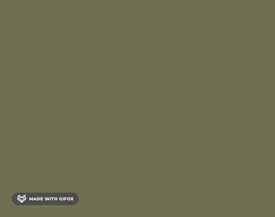

---
{
  "title": "footer 始终保持在最底部 css 实现与 js 实现优缺点对比",
  "staticFileName": "footer_bottom.html",
  "author": "guoqzuo",
  "createDate": "2021/05/04",
  "description": "让 footer 一直保持在最底部是比较常见的需求，css 和 js 都可以实现，一般推荐使用 css 实现，下面来看看具体实现，以及他们的优缺点。需要考虑两种情况：1. 内容没占满视窗时，footer 在最底部，需要 body 有最小高度，才能撑起来 2. 内容较多时，滚动到底部才能看到 footer，且不遮挡内容区域",
  "keywords": "footer一直保持到底部怎么实现,footer区域保持在底部,footer固定到底部",
  "category": "CSS"
}
---
# footer 始终保持在最底部 css 实现与 js 实现优缺点对比
让 footer 一直保持在最底部是比较常见的需求，css 和 js 都可以实现，一般推荐使用 css 实现，下面来看看具体实现，以及他们的优缺点



以下面的结构为例

```html
<body>
 <article class="container">
    <header>顶部</header>
    <section class="main">中间内容部分</section>
    <footer>底部</footer>
  </article>
</body>
```

需要考虑两种情况：
1. 内容没占满视窗时，footer 在最底部，需要 body 有最小高度，才能撑起来
2. 内容较多时，滚动到底部才能看到 footer，且不遮挡内容区域

## 方法 1：css 方式 - position: absolute

1. footer 使用 position: absolute; bottom: 0; 保持在底部。
2. 对于可能遮挡中间内容区域的问题，将 body 设置为 relative，注意不是 container，这样可以让 footer 内容保持在body最底部
3. 内容较多时，footer position: absolute 会遮挡内容部分，需要将 container 加一个 padding-bottom: footer 高度，来防止遮挡

[方法 1 - 在线示例](https://zuoxiaobai.github.io/fedemo/src/DebugDemo/footer%E5%A7%8B%E7%BB%88%E6%98%BE%E7%A4%BA%E5%9C%A8%E6%9C%80%E5%BA%95%E9%83%A8/index-css-absolute.html)、[方法 1 - 代码 | github](https://github.com/zuoxiaobai/fedemo/blob/master/src/DebugDemo/footer%E5%A7%8B%E7%BB%88%E6%98%BE%E7%A4%BA%E5%9C%A8%E6%9C%80%E5%BA%95%E9%83%A8/index-css-absolute.html)

**优点：css 即可实现**

**缺点：需要知道 footer 具体高度。对于 footer 高度不确定的场景，就不合适了。**
```css
* { margin: 0; }
body {
  position: relative; /* 当 footer 为 position 为 absolute 时，放置到 body 底部 */
  min-height: 100vh; /* 最小高度 100% 视窗高度 */
}
.container {
  padding-bottom: 50px; /* 防止内容被 footer 遮挡 */
}
footer { 
  position: absolute; /* 放到页面最底部 */
  bottom: 0;
  left: 0;
  height: 50px;
  width: 100%;
  background: yellow;
}
```
## 方法 2：css 方式 - 中间部分 flex: 1
使用 flex 纵向布局，中间部分使用 flex: 1，内容不足时自动撑开

[方法 2 - 在线示例](https://zuoxiaobai.github.io/fedemo/src/DebugDemo/footer%E5%A7%8B%E7%BB%88%E6%98%BE%E7%A4%BA%E5%9C%A8%E6%9C%80%E5%BA%95%E9%83%A8/index-css-flex1.html)、[方法 2 - 代码 | github](https://github.com/zuoxiaobai/fedemo/blob/master/src/DebugDemo/footer%E5%A7%8B%E7%BB%88%E6%98%BE%E7%A4%BA%E5%9C%A8%E6%9C%80%E5%BA%95%E9%83%A8/index-css-flex1.html)

**优点：css 即可实现，不需要知道 footer 区域高度**

**缺点：需要注意父容器高度，最小高度要占满屏幕，有嵌套时，需要使用 height: 100%；且整体需要使用 flex 布局**
```css
* { margin: 0 }
.container { 
  display: flex; /* 使用 flex 纵向布局 */
  flex-direction: column;
  min-height: 100vh;
  box-sizing: border-box;
}
.main {
  flex: 1; /* 中间内容部分 flex-grow: 1 内容不足时自动撑开 */
}
footer {  /* 不需要知道底部高度 */
  padding: 10px;
  background: yellow;
}
```

## 方法 3：js 方式 - 监听页面整体滚动高度与视窗高度动态设置样式
页面 mounted 后，判断视窗高度 和 整体滚动高度（包含 footer高度），如果小于视窗高度，则添加一个 固定底部的 class，否则去掉该 class

[方法 3 - 在线示例](https://zuoxiaobai.github.io/fedemo/src/DebugDemo/footer%E5%A7%8B%E7%BB%88%E6%98%BE%E7%A4%BA%E5%9C%A8%E6%9C%80%E5%BA%95%E9%83%A8/index-js.html)、[方法 3 - 代码 | github](https://github.com/zuoxiaobai/fedemo/blob/master/src/DebugDemo/footer%E5%A7%8B%E7%BB%88%E6%98%BE%E7%A4%BA%E5%9C%A8%E6%9C%80%E5%BA%95%E9%83%A8/index-js.html)

**优点：无**

**缺点：页面不刷新的情况下，动态增加内容，需要重新判断一次，不推荐**

下面是 vue 的实现
```js
// :class="fixed ? 'flexd-bottom' : ''"
// data: { fixed: false }
 // 处理 footer 
methods: {
  handleFooter() {
    let { clientHeight } = document.documentElement;
    this.fixed = false 
    this.$nextTick(() => {
      let { scrollHeight: pageScrollHeight } = document.querySelector('.container')
      // 如果整体页面高度(包含默认加载的 bottom) < 视窗高度 固定到底部
      this.fixed = pageScrollHeight < clientHeight
    })
  }
},
mounted() {
  this.handleFooter()
}
// &.fixed-bottom {
//   position: absolute;
//   bottom: 0;
// }
```


## 测试 demo 
```html
<head>
  <meta charset="UTF-8">
  <title>测试 footer</title>
  <script src="https://cdn.jsdelivr.net/npm/vue/dist/vue.js"></script>
  <style>
    * { margin: 0 }
    footer { height: 50px; background: yellow; }
  </style>
</head>
<body>
  <article id="app" class="container">
    <header>
      <h2>foot 始终在顶部测试</h2>
    </header>
    <section class="main">
      占位数：<button v-for="item in list" :key="`btn-${item}`" @click="changeCount(item)">{{item}}</button>
      <div v-for="item in count" :key="`gap-${item}`">
        占位 {{item}}
      </div>
    </section>
    <footer>
      Copyright © 2016-2021 zuo11.com. 鄂ICP备16014741号-1
    </footer>
  </article>
  <script>
    let app = new Vue({
      el: '#app',
      data() {
        return {
          list: [5, 50, 100],
          count: 5
        }
      },
      methods: {
        changeCount(value) {
          this.count = value
        }
      }
    })
  </script>
</body>
</html>
```