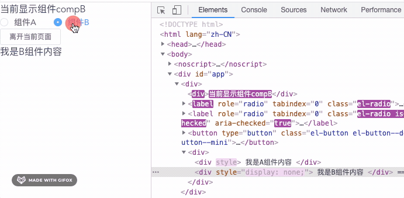

---
{
  "title": "v-if 和 v-show 生命周期钩子函数有什么不同",
  "staticFileName": "v-if_v-show_hooks.html",
  "author": "guoqzuo",
  "createDate": "2021/05/04",
  "description": "在 vue 中我们知道 v-if 和 v-show 都可以用来控制内容的显示与隐藏，他们的区别是 1. v-if 是惰性加载，只有为 true 时，才真正渲染，否则页面是不存在该元素的。为 false 时，直接从 dom 移除。2. v-show 是根据 css display 属性来显示和隐藏组件的。那么他们的生命周期钩子函数有什么区别呢？1. v-show 控制隐藏或显示的组件，一进入就立即加载，执行 beforeCreate、created、beforeMount、mounted，中间切换显示和隐藏不会触发钩子函数 2. v-if 只有为 true 时，才会正常执行加载的钩子函数，否则不会加载。当切换时，实时挂载(created/mounted)、卸载组件(destoryed)。",
  "keywords": "v-if 与 v-show 钩子函数区别,v-if 与 v-show 区别",
  "category": "Vue"
}
---
# v-if 和 v-show 生命周期钩子函数有什么不同

在 vue 中我们知道 v-if 和 v-show 都可以用来控制内容的显示与隐藏，他们的区别是

1. v-if 是惰性加载，只有为 true 时，才真正渲染，否则页面是不存在该元素的。为 false 时，直接从 dom 移除。
2. v-show 是根据 css display 属性来显示和隐藏组件的

那么他们的生命周期钩子函数有什么区别呢？

1. v-show 控制隐藏或显示的组件，一进入就立即加载，执行 beforeCreate、created、beforeMount、mounted，中间切换显示和隐藏不会触发钩子函数
2. v-if 只有为 true 时，才会正常执行加载的钩子函数，否则不会加载。当切换时，实时挂载(created/mounted)、卸载组件(destoryed)。

使用场景：v-if 适合在 true、false 切换不频繁的场景，当为 false 时，可以减少初次渲染时间。如果切换很频繁 v-if 会不断的挂载、卸载组件，会加大开销，这时使用 v-show 就比较好，尽管它的初始开销会大一点。