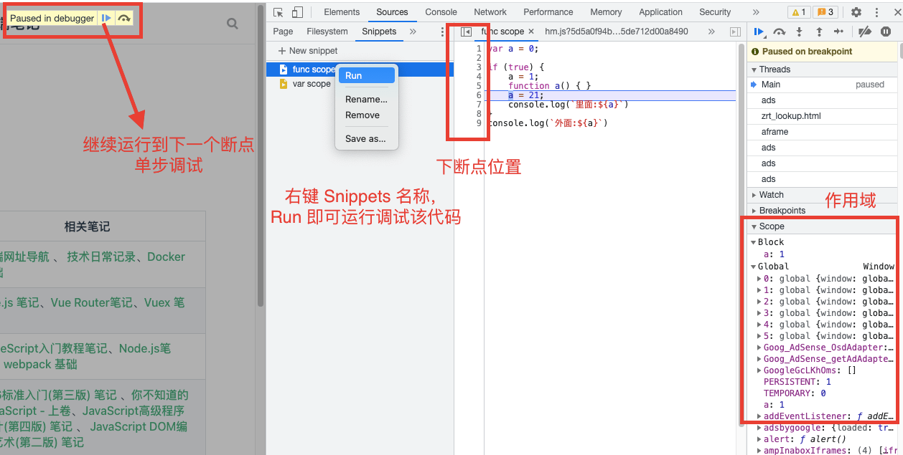

---
{
  "title": "js if(true) 代码块中函数和变量同名时作用域提升问题，Chrome Devtools Snippets 断点调试",
  "staticFileName": "js_hoisting.html",
  "author": "guoqzuo",
  "createDate": "2021/09/09",
  "description": "在 JS 代码块中变量和函数同名，作用域怎么提升的问题是比较难以理解的，对于不同的浏览器还有不同的结果，下面来看几个例子，我们可以通过 Chrome 浏览器中的 DevTools - Sources - Snippets 中利用断点调试的功能来看浏览器是如何一步步执行的。",
  "keywords": "js hoisting,js 函数提升,js 变量提升,Chrome Devtools Snippets 断点调试",
  "category": "JavaScript"
}
---
# js if(true) 代码块中函数和变量同名时作用域提升问题，Chrome Devtools Snippets 断点调试

在 JS 代码块中变量和函数同名，作用域怎么提升的问题是比较难以理解的，对于不同的浏览器还有不同的结果，下面来看几个例子：

我们可以通过 Chrome 浏览器中的 DevTools - Sources - Snippets 中利用断点调试的功能来看浏览器是如何一步步执行的。



## 示例 1
下面的例子中，里面的 a 为 21 是没有争议的，主要是为什么外面的 a 值会为 1(chrome) 或 21(safari)，用上面的方法来进行 Chrome 断点调试
```js
var a = 0;
if (true) { // global 作用域  a 为 0，
  // 执行到这里时，函数会被提升 block 块级作用域中 a 为 function () {}
	a = 1;
  // 上面的 a = 1 执行后，block 作用域中 a 为 1 可以理解，但奇怪的是 global 作用域 a 也被设置为了 1
	function a() { }
	a = 21; // 这一句执行后 block 作用域中 a 为 21，全局 global 为 1
	console.log(`里面:${a}`)
}
console.log(`外面:${a}`)
```
Chrome 版本 91.0.4472.114 / Firefox 89.0 (64 位) 结果
```js
里面:21 
外面:1
```
Safari 14.0.3 (16610.4.3.1.7) 结果
```js
里面:21
外面:21
```
## 示例 2
```js
{
	function a() {};
	a = 50;
}
console.log(a); // ƒ a() {}
{
	b = 50;
	function b() {};
}
console.log(b); // 50
```

总结：这种问题，我们一般会陷入一个误区，就是通过 chrome 的结果来倒推，可能是怎么执行的。

但你会发现可能还是比较难理解。**这种问题基本是没有意义的，正常情况下，不会有变量和函数同名，也不会这样使用**，除非去研究 Chrome v8 引擎的源码，看看是怎么执行的，不然对于非专家级别的开发者来说，是没必要深入到这一步的。

**如果不是从内核源码来剖析，瞎猜没有任何说服力。**