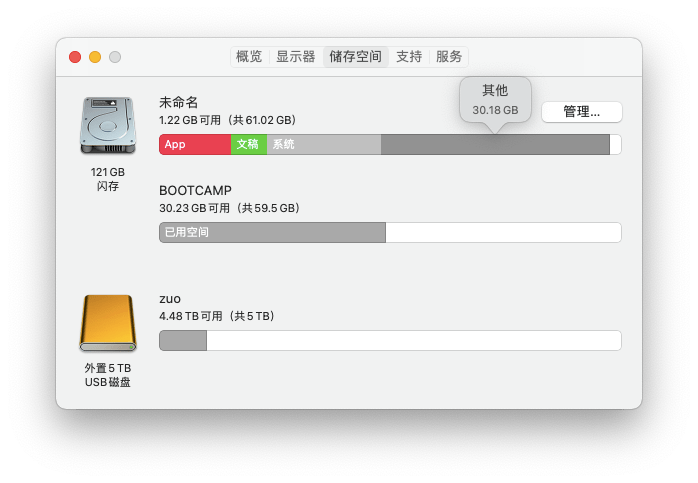
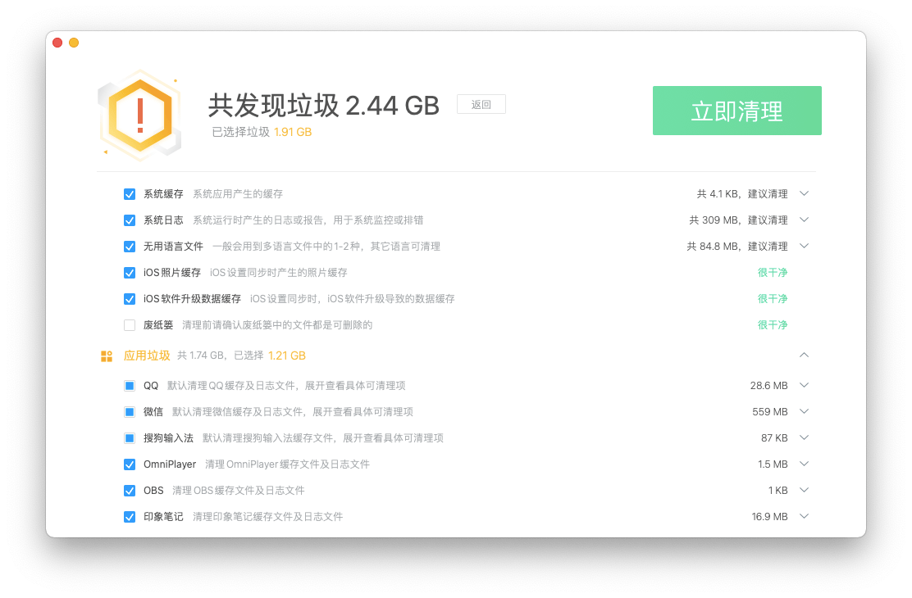

# mac 其他文件怎么清理，使用免费的腾讯柠檬清理代替 CleanMyMac

mac 存储空间里面的其他文件占用较多，它主要是一些碎片文件、缓存等，一般不通过工具软件很难清理。如下图：

mac 清理工具中，CleanMyMac 算是比较知名的一个，但它是收费的，这里介绍一款国产免费的清理工具 - [腾讯柠檬清理](https://lemon.qq.com/)

关于柠檬清理与其他同类产品的对比，官方写了一遍总结，可以看看 [腾讯柠檬清理，真的比CleanMyMac好用么？](https://lemon.qq.com/blog/articles/004-lemon-vs-cleanmymac.html)