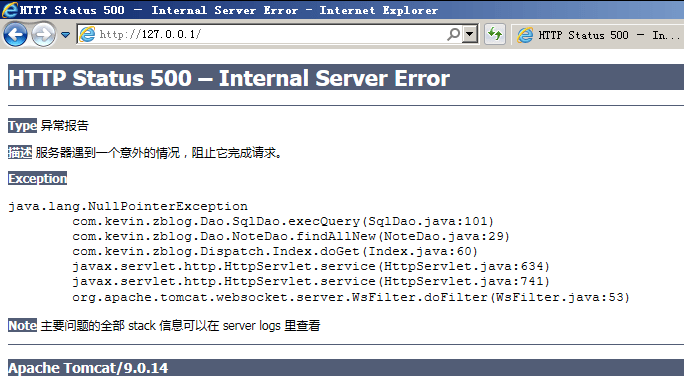

---
{
  "title": "nginx emerg bind to 0.0.0.0:80 failed <10013, 80 端口被占用",
  "staticFileName": "mginx_80_port.html",
  "author": "guoqzuo",
  "createDate": "2021/09/09",
  "description": "重启服务器后发现开启 nginx 时，报错 nginx emerg bind to 0.0.0.0:80 failed <10013:，这个错误一般是 80 端口被占用的问题，访问 http://127.0.0.1 看看 80 端口的情况，发现是 Java 服务，检查后发现 tomcat 开了，它占用了 80 端口，关掉 tomcat，再次运行就可以了。",
  "keywords": "nginx 80 端口被占用,emerg bind to 0.0.0.0:80 failed",
  "category": "运维部署与版本控制"
}
---
# nginx emerg bind to 0.0.0.0:80 failed <10013, 80 端口被占用

最近由于服务器非常卡顿，于是重启了服务器，重启后发现开启 nginx 时，报错 nginx emerg bind to 0.0.0.0:80 failed <10013:，**这个错误一般是 80 端口被占用的问题，访问 http://127.0.0.1 看看 80 端口的情况**，发现是 Java 服务，检查后发现 tomcat 开了，它占用了 80 端口，关掉 tomcat，再次运行就可以了。

参考：[Nginx 错误处理方法: bind() to 0.0.0.0:80 failed](https://blog.csdn.net/zero_295813128/article/details/50914233)