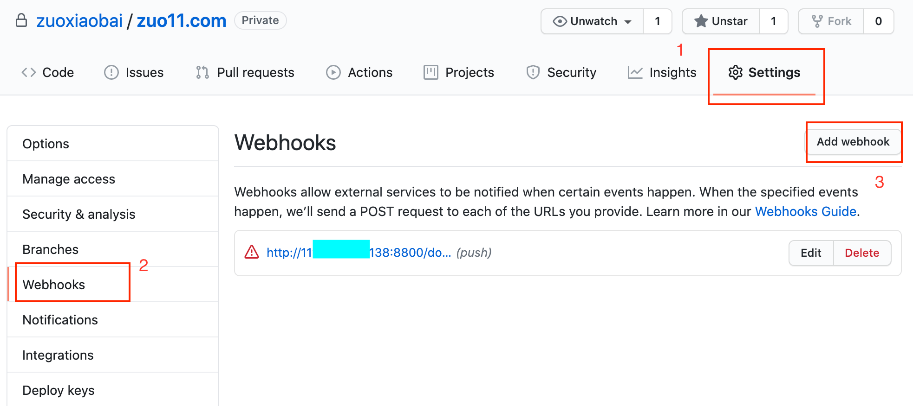
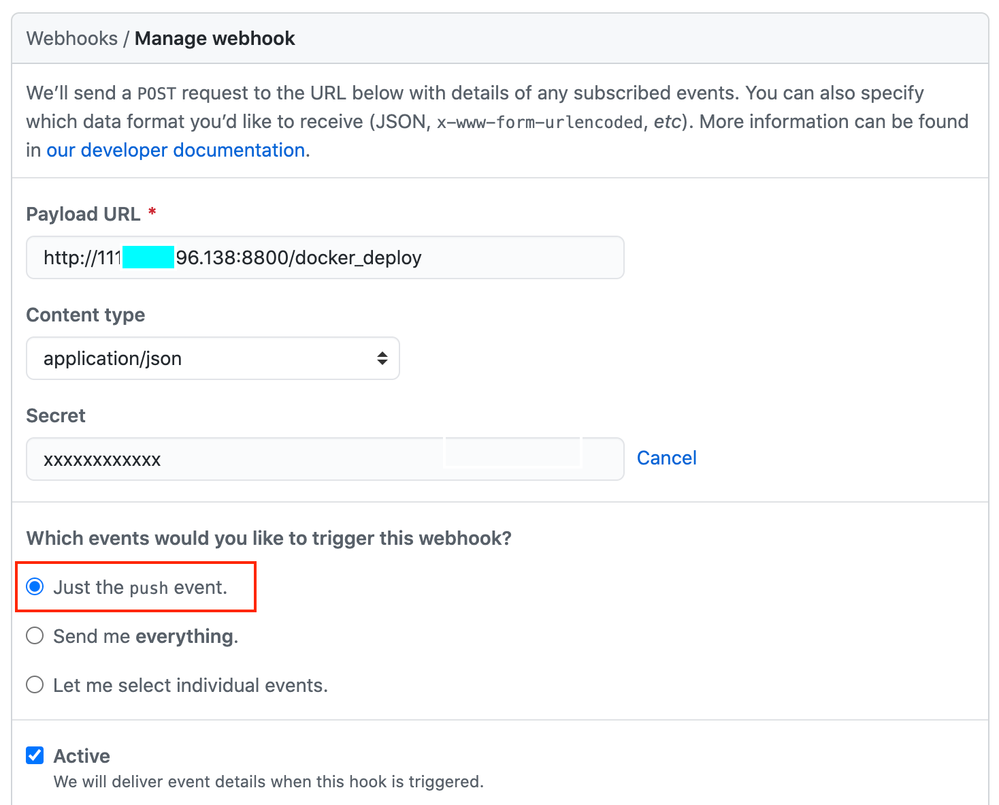
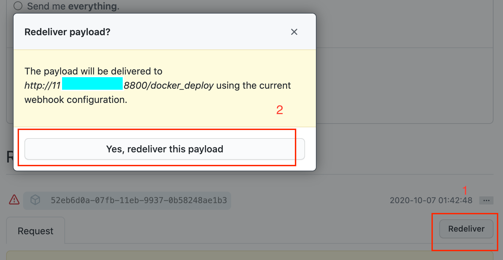
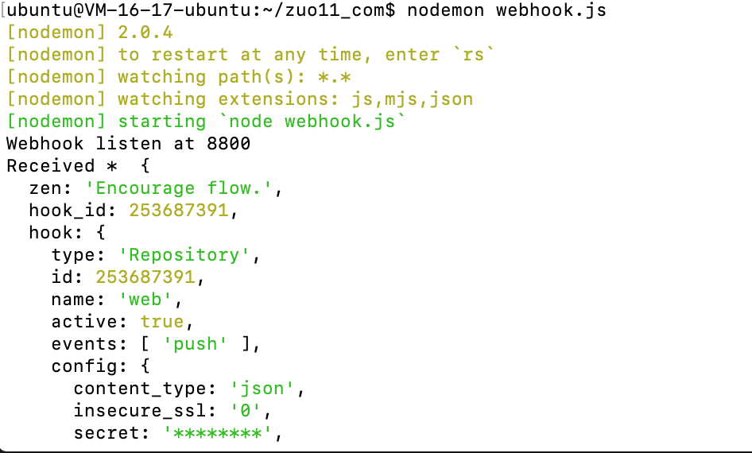
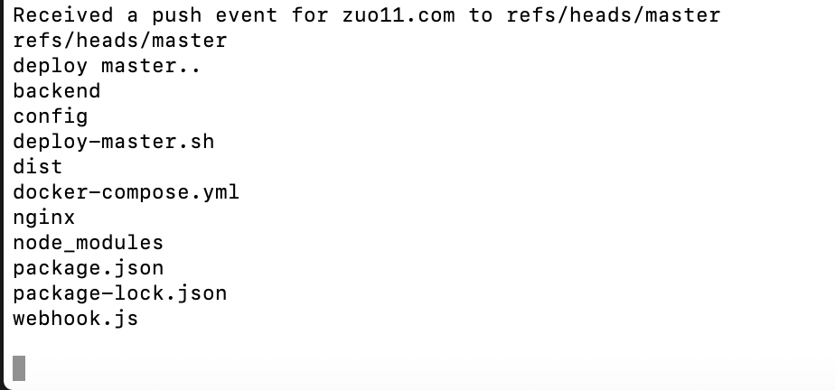

# node 自动化部署、持续集成的核心原理: node 可以执行 shell 脚本 + 可以监听请求

node 可以用来支撑实现自动化部署、持续集成，核心原理是：

1. node 可以执行 shell 脚本，而部署流程一般都是写在 shell 脚本中的。
2. node 可以作为服务器 server, 当接收到请求后，根据条件判断是否执行部署的 shell 脚本。

我们这里结合 github webhooks 来实现持续集成，自动化部署，关键细节在于：

1. github 对应仓库 Settings - Webhooks，配置当仓库发生变化时（比如 push 操作）请求一个自定义接口地址
2. github 请求这个接口地址时，我们需要做一些校验，github-webhook-handler npm 包帮我们做好了，直接使用即可，当接收到 main 分支 push 请求时，使用 node 的 child_process.spawn 可以执行 shell 脚本进行部署。

整个过程概要
1. 提交新的内容到 github 仓库，github 仓库接收到 push 事件，触发对应的 webhooks 事件，向设置的一个 URL 发送 POST 请求。
2. 我们专门用一个 node 接口来接收该请求。接收到请求后，如果是 main 分支的 push 事件，用 node 执行 shell 脚本（.sh 文件）
3. 本地 shell 脚本用于 git pull 最新代码，并重启服务运行最新代码（比如使用 docker-compose up 部署最新代码）

下面来看具体怎么操作

## 配置github webhooks
将项目文件放到 github 仓库，然后在对应的仓库，setting、选择 webhooks，添加 webhooks，如下图



新建一个 webhooks，有下面几个字段
- Payload URL: `http://www.xxx.com:8800/docker_deploy` ，发送post请求的地址，你自己的服务器要处理该请求。测试时可以用 IP 地址
- Content type: application/json，发送数据类型，一般选json，方便处理
- secret: xxx  秘钥，做验证用，接口处理是需要使用
- which events would you like to trigger this webhook? 触发该接口的时机我们选择仅 push 时触发 



新增 webhooks 后，可以发测试请求，点击 redeliver 弹窗提示后再点击确认，这样就可以调试接口了。如下图



## 写 node 接口来处理 webhooks 请求
我们用一个简单的 nodejs 文件，在 8800 端口新建一个接口来处理 github webhooks 的请求，先写一个简单的测试 js

```js
// webhook.js
const http = require('http')
const createHandler = require('github-webhook-handler')
const handler = createHandler({
  path:'/docker_deploy',
  secret:'xxx' // 之间设置的秘钥
})

http.createServer((req,res) => {
  handler(req,res,err => {
    res.statusCode = 404
    res.end('no such location')
  })
}).listen(8800, () => {
  console.log('Webhook listen at 8800')
})

handler.on('error',err => {
  console.error('Error',err.message)
})

// 接收所有事件(包括push事件)打印日志
handler.on('*',event => {
  console.log('Received * ',event.payload)
})
```

我们要在服务器跑起这个服务需要先在 ubuntu 系统上安装 node/npm
```bash
# 默认安装方法
sudo apt-get install -y nodejs
sudo apt install npm

# ubuntu 安装node版本过低，怎么解决
node -v # v8.10.0
npm -v # 3.5.2

# 将node升级到最新稳定版
sudo npm cache clean -f
sudo npm install -g n
sudo n stable
PATH="$PATH" # 立即在终端生效

# 再查看版本就是最新稳定版了
node -v # v12.18.4
npm -v # 6.14.6
```

参考：[使用apt-get install安装node.js导致安装成低版本的解决方案 | CSDN](https://blog.csdn.net/skylark0924/article/details/79306999)

注意 npm init 一个 package.json，并安装 github-webhook-handler 模块，再 `nodemon webhook.js` 开启服务，也可以把 nodemon webhook.js 使用 pm2 来管理。然后再在 github webhooks 里触发测试请求，当看到 Received * log，即表示接收成功，如下图：



## sh脚本：拉取最新代码，重新部署
这里已经知道如何接收事件了，我们再在 webhook.js 里加入执行 shell 脚本的代码

```js
// 使用子进程执行命令
function run_cmd(cmd, args, callback) {
  var spawn = require('child_process').spawn;
  var child = spawn(cmd, args);
  var resp = "";
  child.stdout.on('data', function (buffer) { resp += buffer.toString(); });
  child.stdout.on('end', function () { callback(resp) });
}

// 接收到 push 事件时，执行 sh ./deploy-master.sh
handler.on('push', function (event) {
  console.log('Received a push event for %s to %s', event.payload.repository.name, event.payload.ref);
  // 分支判断，如果是master，已改名 main
  if(event.payload.ref === 'refs/heads/main'){
    console.log('deploy main..')
    run_cmd('sh', ['./deploy-master.sh'], function(text){ console.log(text) });
  }
})
```
在当前目录新建一个 deploy-master.sh 文件，内容先只有 `ls`，用于测试，修改代码后，再次测试，如下图，ls执行成功过即表示代码正常。

**注意，1. 模拟请求可能会拿不到 event.payload.ref 的值，需要出发真实的 push 请求才有 2.如果 deploy-master.sh 没有可执行权限，那么就需要执行 chmod +x 文件名，来给他加可执行权限**



修改部署脚本
```bash 
# 测试
# ls

# deploy-master.sh
echo "Start Deploy"

# 获取最新版代码
git pull

# 停止原先的镜像实例(容器)
docker-compose down
# 重新build，创建实例化镜像(容器)
docker-compose up -d --force-recreate --build
```

这里要注意 git pull 的问题。我们这里要放弃之间 vscode 插件部署的方法，要使用 git pull 的方式来更新部署代码，这样才不会有冲突。

这里我们要先在 ubuntu 系统里 git clone github的仓库，建议使用 ssh 的方法， 使用 `ssh-keygen -t rsa -C "xxx@qq.com"` 生成公钥私钥，然后再把公钥配置到 github 个人账号 setting 里的 ssh keys里面。就可以使用 ssh 地址正常拉取了。

这样就可以实现提交代码到 main 分支就自动部署最新代码了