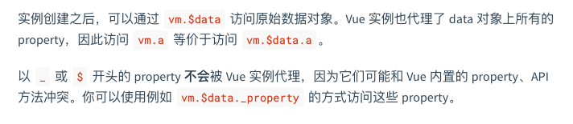
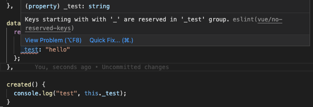

---
{
  "title": "vue data 中以下划线开头的变量为 undefined, eslint 提示 Keys starting with '_' are reserved",
  "staticFileName": "vue_data_underline.html",
  "author": "guoqzuo",
  "createDate": "2021/09/09",
  "description": "在 vue 中，如果 data 中定义了以下划线开头的变量名，是无法获取到值的，一直是 undefined，为什么会这样呢？如果你安装了 eslint，会自动提示 Keys starting with '_' are reserved in '_test' group(vue/no-reserved-keys). 在官方文档 API 中有搜索 data 可以查到: 以 _ 或 $ 开头的 property 不会被 Vue 实例代理，因为它们可能和 Vue 内置的 property、API 方法冲突",
  "keywords": "vue data 中 _ 开头的变量为 undefined,data 下划线开头的变量,vue _ 开头的变量,vue  Keys starting with '_' are reserved",
  "category": "Vue"
}
---
# vue data 中以下划线开头的变量为 undefined, eslint 提示 Keys starting with '_' are reserved

在 vue 中，如果 data 中定义了以下划线开头的变量名，是无法获取到值的，一直是 undefined，为什么会这样呢？如果你安装了 eslint，会自动提示 Keys starting with '_' are reserved in '_test' group(vue/no-reserved-keys). 

在官方文档 API 中有搜索 data 可以查到: **以 _ 或 `$` 开头的 property 不会被 Vue 实例代理，因为它们可能和 Vue 内置的 property、API 方法冲突**

另外，如果项目中开启了 ESLint 会自动提示该错误 "vue/no-reserved-keys" 不能使用保留关键字，如下图：

因此 ESLint 比我们想象的更加实用，它不仅仅只是单纯的 JS 语法检查。
