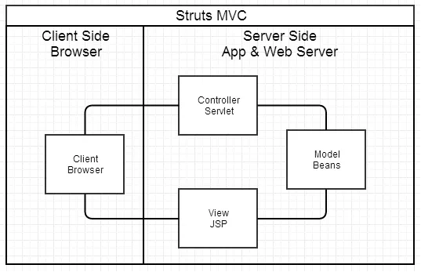
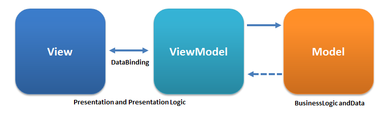

# 什么是 mvc, 什么是 mvvm, 怎么理解 mvc 与 mvvm，mvc 和 mvvm 有什么区别？

每个新技术的出现都有其历史原因，MVVM 也是如此。Vue 就是基于 MVVM 模式。那什么是 MVVM 构架模式，和 MVC 模式有什么区别呢？

在介绍 MVVM 之前，我们先需要了解什么是 MVC 模式

在 ajax 技术没有出现之前，**html 页面中发送 http 请求会刷新整个页面**。页面内容强依赖后端接口响应的内容，于是催生了 jsp、php、asp 等前后端都耦合在一起的技术。下面来看一个实例

```html
<!-- login 页面 -->
<form action="/login" method="post">
  <input type="text" name="um" placeholder="请输入账号"/>
  <input type="password" name="pw" placeholder="请输入密码"/>
  <button type="submit">登录</button>
</form>
```

登录页面中，点击登录，页面会重定向到 /login 发送 post 请求给后端，后端处理好后，返回登录成功后的 html 文本，浏览器拿到 html 文本渲染页面，这就完成了登录功能。

为了更好的组织代码、解耦各个部分，MVC 模式被引入到 web 开发，比如 Struts、Spring MVC


MVC 是一种经典的设计模式，是 Model-View-Controller 的缩写，即模型-视图-控制器。
- Model 模型 对应数据 Java 类
- View 视图 对应 JSP 页面显示（服务端渲染）
- Controller 控制器 Servlet，用于处理客户端 HTTP 请求、加工模型数据、再响应对应的视图(html)给客户端



MVC 在不同的平台有不同的实现，比如 iOS MVC、ASP.NET MVC、Spring MVC 等，细节参考：[浅谈 MVC、MVP 和 MVVM 架构模式](https://draveness.me/mvx/)，这种构架模式的出现主要是为了解耦模块，将不同的功能模块分散到合适的位置中，提高开发维护效率。

假设前端有 MVC 模式，M 对应数据 js 对象、V 对应视图 html。如果遵循 MVC 模式，C 用来解耦 M、V。那 C (控制器)负责的事情就比较多，主要是处理事件流
- 绑定 UI 表单交互事件
- 接收到事件后处理业务逻辑
- 业务逻辑可能会请求接口获取/操作 M 数据
- 根据需要操作 dom 更新 V

由于 JS DOM API 在使用复杂度、兼容性方面需要较多的处理，像 jQuery 这种易于绑定事件，操作 dom 的框架开始流行起来，使用 jQuery 你不需要考虑 DOM API 兼容性、且操作 dom 简单，ajax 请求简单，提升了开发效率。

后面随着 ajax、移动端、小程序等多平台的兴起，前后端分离的概念出现了，写一套接口各个平台适用，而不是单纯的写接口渲染 web 页面。MVC 在后端 View 这一层不再是 UI，而是改为返回 JSON 模型数据，多端兼容。

当然前后端分离也有缺点，不利于 SEO，这也催生了服务端渲染 SSR 框架的产生。

MVVM 设计模式是 Model-View-ViewModel 的缩写，模型-视图-视图模型，是 MVC 的一种发展



viewModel 主要实现了双向绑定，一般在框架内部实现：
- 数据模型 M 和视图 V 通过 viewModel 绑定，只要修改了 数据模型 M ，viewModel 会自动帮你操作 dom 更新 视图。
- 视图 V 表单输入变化，viewModel 会自动将输入内容同步到 M 数据模型中

Vue 是类似 MVVM 模式的一种实现，使用 Vue 后，无需再手动操作 dom，只需改变数据即可。这样极大提升了开发效率，可以抽出更多的时间来关注业务逻辑。

参考：
- [MVC，MVP 和 MVVM 的图示 - 阮一峰的网络日志](http://www.ruanyifeng.com/blog/2015/02/mvcmvp_mvvm.html)
- [什么是MVVM，MVC和MVVM的区别，MVVM框架VUE实现原理](https://baijiahao.baidu.com/s?id=1596277899370862119&wfr=spider&for=pc)
- [Model–view–controller - Wikipedia](https://en.wikipedia.org/wiki/Model%E2%80%93view%E2%80%93controller)
- [Model–view–viewmodel - Wikipedia](https://en.wikipedia.org/wiki/Model%E2%80%93view%E2%80%93viewmodel)

