---
{
  "title": "Vue + Node.js 从 0 到 1 实现自动化部署工具",
  "staticFileName": "zuo_deploy_think.html",
  "author": "guoqzuo",
  "createDate": "2022/02/28",
  "description": "最近写了一个自动化部署的 npm 包 zuo-deploy。客户端 Vue + ElementUI，服务 koa + socket + koa-session 等。已开源在 github。zuoxiaobai/zuo-deploy 欢迎 Star、Fork。这里介绍下具体实现细节、思路。",
  "keywords": "自动化部署,js实现CICD,CI,CD,部署工具,zuo-deploy,实现自动化部署,node执行shell脚本,auto deploy,js deploy",
  "category": "运维部署与版本控制"
}
---
# Vue + Node.js 从 0 到 1 实现自动化部署工具
最近写了一个自动化部署的 npm 包 [zuo-deploy](https://github.com/dev-zuo/zuo-deploy)，只需点击一个按钮，就可以执行服务器部署脚本，完成功能更新迭代。客户端使用 Vue + ElementUI，服务 koa + socket + koa-session 等。基础功能代码 300 行不到，已开源在 github。zuoxiaobai/zuo-deploy 欢迎 Star、Fork。这里介绍下具体实现细节、思路。
## 目录结构
```bash
├── bin # 命令行工具命令
│   ├── start.js # zuodeploy start 执行入口
│   └── zuodeploy.js # zuodeploy 命令入口，在 package.json 的 bin 属性中配置
├── docImages # README.md 文档图片 
├── frontend # 客户端页面/前端操作页面（koa-static 静态服务指定目录）
│   └── index.html # Vue + ElementUI + axios + socket.io
├── server # 服务端
│   ├── utils
│   │   ├── logger.js # log4js 
│   │   └── runCmd.js # node child_process spawn（执行 shell 脚本、pm2 服务开启）
│   └── index.js # 主服务（koa 接口、静态服务 + socket + 执行 shell 脚本）
├── .eslintrc.cjs # eslint 配置文件 + prettier
├── args.json # 用于 pm2 改造后，跨文件传递端口、密码参数
├── CHANGELOG.md # release 版本功能迭代记录
├── deploy-master.sh # 用于测试，当前目录开启服务偶，点击部署按钮，执行该脚本
├── index.js # zuodeploy start 执行文件，用于执行 pm2 start server/index.js 主服务 
├── package.json # 项目描述文件，npm 包名、版本号、cli 命令名称、
├── publish.sh # npm publish（npm包） 发布脚本
└── README.md # 使用文档
```

## 前后端技术栈、相关依赖
- 前端/客户端
  - 静态 html + css，非前端工程化，库都以 cdn 形式引入，通过库以 UMD 打包方式暴露的全局变量使用
  - vue3，MVVM 框架，不用操作 dom
  - element-plus，基础表单样式统一、美化
  - axios，请求接口
  - socket.io，接收实时部署 log
- 服务端
  - 基于 Node.js 技术栈，无数据库
  - commander，用于生成的命令 zuodeploy 运行时帮助文档、提示，zuodeploy start 执行入口
  - prompts，参照 vue-create，引导用户输入端口、密码
  - koa，http 服务端, 提供接口、静态服务运行容器（类似 nginx、tomcat 等）
  - koa-bodyparser，用于解析 post 请求参数（login 鉴权接口需要）
  - koa-router，用于不同接口（路径，比如 /login, /deploy等）执行不同的方法
  - koa-session，用于接口鉴权，防止他人获取到部署接口后疯狂请求部署
  - koa-static，静态服务器，类似 nginx 启动静态服务
  - socket.io，socket 服务端，当 git pull, npm run build 部署时间较长时，实时发送 log 到前端
    - 普通接口，可能需要等完全部署好后，才能拿到结果
  - log4js，带时间戳的 log 输出
  - pm2，直接执行，当 terminal 结束服务会被关掉，用 pm2 以后台方式静默执行

## 基础功能实现思路
最初目标：前端页面点击部署按钮，可以直接让服务器执行部署，并将部署 log 返回给前端

怎么去实现？
- 1.要有一个前端页面，给出 部署 按钮，日志显示区域。
- 2.前端页面与服务器交互，必须要有一个服务端 server
  - 2.1 提供接口，前端页面点击部署，请求该接口，知道什么时候要执行部署，
  - 2.2 后端接口接收到请求后，怎么执行部署任务，
  - 2.3 shell 脚本执行的 log，怎么搜集并发送给前端。同上，spawn 支持 log 输出

技术栈确定：
- 1.Vue + ElementUI 基本页面布局+基本逻辑，axios 请求接口数据
- 2.使用 node 技术栈来提供 服务端 server
  - 2.1 使用 koa/koa-router 实现接口
  - 2.2 部署一般是执行 shell 脚本，node 使用内置子进程 spawn 可以执行 shell 脚本文件、跑 terminal 下运行的命令操作
  - 2.3 spawn 执行时，子进程 stdout, stderr 可以获取到脚本执行 log，收集后返回给前端

考虑到前端页面的部署问题，可以与 koa server 服务放到一起，使用 koa-static 开启静态文件服务，支持前端页面访问

这里不使用前端工程化 `@vue/cli` ，直接使用静态 html，通过 cdn 引入 vue 等

### 1.客户端 Vue+ElementUI+axios
前端服务我们放到 frontend/index.html，koa-static 静态服务直接指向 frontend 目录就可以访问页面了

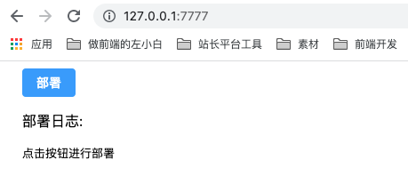

核心代码如下：

> 注意：cdn 链接都是 // 相对路径，需要使用 http 服务打开页面，不能以普通的 File 文件形式打开！可以等到后面 koa 写好后，开启服务再访问

```html
<head>
  <title>zuo-deploy</title>
  <!-- 导入样式 -->
  <link rel="stylesheet" href="//unpkg.com/element-plus/dist/index.css" />
  <!-- 导入 Vue 3 -->
  <script src="//unpkg.com/vue@next"></script>
  <!-- 导入组件库 -->
  <script src="//unpkg.com/element-plus"></script>
  <script src="https://unpkg.com/axios/dist/axios.min.js"></script>
</head>

<body>
  <div id="app" style="margin:0 20px;">
    <el-button type="primary" @click="deploy">部署</el-button>
    <div>
      <p>部署日志:</p>
      <div class="text-log-wrap">
        <pre>{{ deployLog }}</pre>
      </div>
    </div>
  </div>
  <script>
    const app = {
      data() {
        return {
          deployLog: '点击按钮进行部署',
        }
      },
      methods: {
        deploy() {
          this.deployLog = '后端部署中，请稍等...'
          axios.post('/deploy')
            .then((res) => {
              // 部署完成，返回 log
              console.log(res.data);
              this.deployLog = res.data.msg
            })
            .catch(function (err) {
              console.log(err);
            })
        }
      }
    }

    Vue.createApp(app).use(ElementPlus).mount('#app')
  </script>
</body>
```
### 2.服务端koa+koa-router+koa-static
koa 开启 http server，写 deploy 接口处理。koa-static 开启静态服务

```js
// server/index.js
const Koa = require("koa");
const KoaStatic = require("koa-static");
const KoaRouter = require("koa-router");
const path = require("path");

const app = new Koa();
const router = new KoaRouter();

router.post("/deploy", async (ctx) => {
  // 执行部署脚本
  let execFunc = () => {};
  try {
    let res =  await execFunc();
    ctx.body = {
      code: 0,
      msg: res,
    };
  } catch (e) {
    ctx.body = {
      code: -1,
      msg: e.message,
    };
  }
});

app.use(new KoaStatic(path.resolve(__dirname, "../frontend")));
app.use(router.routes()).use(router.allowedMethods());
app.listen(7777, () => console.log(`服务监听 ${7777} 端口`));
```
将项目跑起来

1. 在当前项目目录，执行 `npm init` 初始化 package.json
2. `npm install koa koa-router koa-static --save` 安装依赖包
3. `node server/index.js` 运行项目，注意如果 7777 端口被占用，需要换一个端口

访问 http:// 127.0.0.1:7777 就可以访问页面，点击部署就可以请求成功了

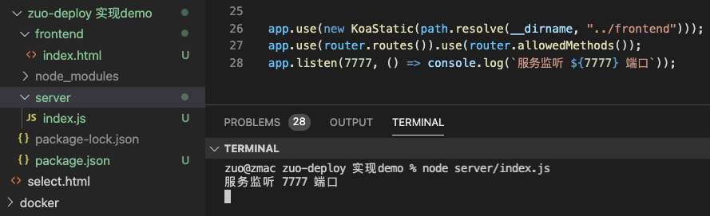

### 3.Node执行shell脚本并输出log到前端
node 内置模块 child_process 下 spawn 执行 terminal 命令，包括执行 shell 脚本的 `sh 脚本文件.sh` 命令 

下来看一个 demo，新建一个 testExecShell 测试目录，测试效果
```js
// testExecShell/runCmd.js
const { spawn } = require('child_process');
const ls = spawn('ls', ['-lh', '/usr']); // 执行 ls -lh /usr 命令

ls.stdout.on('data', (data) => {
  // ls 产生的 terminal log 在这里 console
  console.log(`stdout: ${data}`);
});

ls.stderr.on('data', (data) => {
  // 如果发生错误，错误从这里输出
  console.error(`stderr: ${data}`);
});

ls.on('close', (code) => {
  // 执行完成后正常退出就是 0 
  console.log(`child process exited with code ${code}`);
});
```
运行 `node testExecShell/runCmd.js` 就可以使用 node 执行 `ls -lh /usr`，并通过 ls.stdout 接收到 log 信息并打印

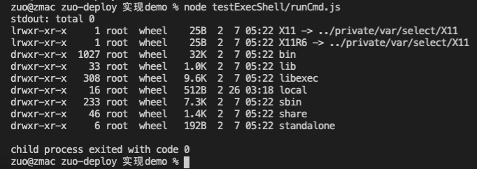

回到正题，这里需要执行 shell 脚本，可以将 `ls -lh /usr` 替换为 `sh 脚本文件.sh` 即可。下面来试试

```js
// testExecShell/runShell.js
const { spawn } = require('child_process');
const child = spawn('sh', ['testExecShell/deploy.sh']); // 执行 sh deploy.sh 命令

child.stdout.on('data', (data) => {
  // shell 执行的 log 在这里搜集，可以通过接口返回给前端
  console.log(`stdout: ${data}`);
});

child.stderr.on('data', (data) => {
  // 如果发生错误，错误从这里输出
  console.error(`stderr: ${data}`);
});

child.on('close', (code) => {
  // 执行完成后正常退出就是 0 
  console.log(`child process exited with code ${code}`);
});
```
创建执行的 shell 脚本，可以先 `sh estExecShell/deploy.sh` 试试是否有可执行，如果没执行权限，就添加（chmod +x 文件名）
```bash
# /testExecShell/deploy.sh
echo '执行 pwd'
pwd
echo '执行 git pull'
git pull
```
运行 `node testExecShell/runShell.js` 就可以让 node 执行 deploy.sh 脚本了，如下图

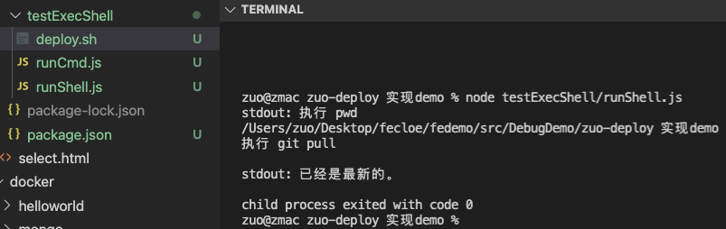

参考：[child_process - Node.js 内置模块笔记](http://fe.zuo11.com/node/node-doc.html#child-process)

### 4.deploy接口集成执行shell脚本功能
修改之前的 deploy 接口，加一个 runCmd 方法，执行当前目录的 deploy.sh 部署脚本，完成后接口将执行 log 响应给前端
```js
// 新建 server/indexExecShell.js，将 server/index.js 内容拷贝进来，并做如下修改
const rumCmd = () => {
  return new Promise((resolve, reject) => {
    const { spawn } = require('child_process');
    const child = spawn('sh', ['deploy.sh']); // 执行 sh deploy.sh 命令

    let msg = ''
    child.stdout.on('data', (data) => {
      // shell 执行的 log 在这里搜集，可以通过接口返回给前端
      console.log(`stdout: ${data}`);
      // 普通接口仅能返回一次，需要把 log 都搜集到一次，在 end 时 返回给前端
      msg += `${data}`
    });

    child.stdout.on('end', (data) => {
      resolve(msg) // 执行完毕后，接口 resolve，返回给前端
    });

    child.stderr.on('data', (data) => {
      // 如果发生错误，错误从这里输出
      console.error(`stderr: ${data}`);
      msg += `${data}`
    });

    child.on('close', (code) => {
      // 执行完成后正常退出就是 0 
      console.log(`child process exited with code ${code}`);
    });
  })
}

router.post("/deploy", async (ctx) => {
  try {
    let res =  await rumCmd(); // 执行部署脚本
    ctx.body = {
      code: 0,
      msg: res,
    };
  } catch (e) {
    ctx.body = {
      code: -1,
      msg: e.message,
    };
  }
});
```

修改完成后，运行 `node server/indexExecShell.js` 开启最新的服务，点击部署，接口执行正常，如下图

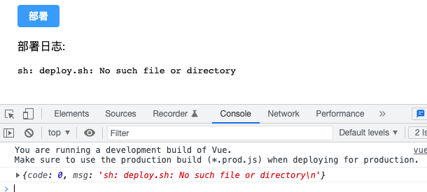

执行的是当前目录的 deploy.sh，没有对应的文件。将上面 testExeclShell/deploy.sh 放到当前目录再点击部署

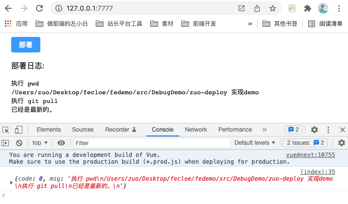

这样自动化部署基础功能基本就完成了。

## 功能优化
### 1.使用 socket 实时输出 log
上面的例子中，普通接口需要等部署脚本执行完成后再响应给前端，如果脚本中包含 git pull、npm run build 等耗时较长的命令，就会导致前端页面一直没log信息，如下图

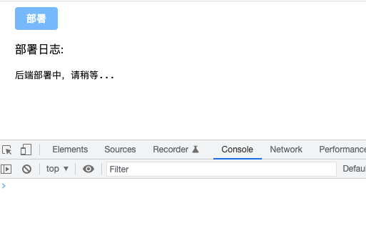

测试 shell
```bash
echo '执行 pwd'
pwd
echo '执行 git pull'
git pull
git clone git@github.com:zuoxiaobai/zuo11.com.git # 耗时较长的命令
echo '部署完成'
```

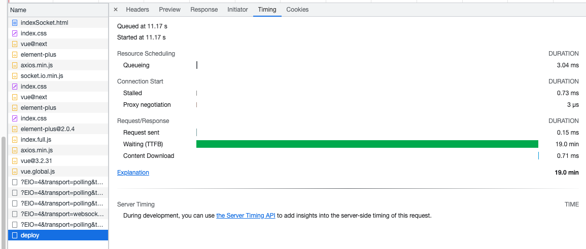

这里我们改造下，使用 [socket.io](https://socket.io/) 来实时将部署 log 发送给前端

socket.io 分为客户端、服务端两个部分

客户端代码
```html
<!-- frontend/indexSocket.html -->
<script src="https://cdn.socket.io/4.4.1/socket.io.min.js"></script>
<script>
  // vue mounted 钩子里面链接 socket 服务端
  mounted() {
    this.socket = io() // 链接到 socket 服务器，发一个 http 请求，成功后转 101 ws 协议
    // 订阅部署日志，拿到日志，就一点点 push 到数组，显示到前端
    this.socket.on('deploy-log', (msg) => {
      console.log(msg)
      this.msgList.push(msg)
    })
  },  
</script>
```
后端 koa 中引入 socket.io 代码
```js
// server/indexSoket.js
// npm install socket.io --save
const app = new Koa();
const router = new KoaRouter();

// 开启 socket 服务
let socketList = [];
const server = require("http").Server(app.callback());
const socketIo = require("socket.io")(server);
socketIo.on("connection", (socket) => {
  socketList.push(socket);
  console.log("a user connected"); // 前端调用 io()，即可连接成功
});
// 返回的 socketIo 对象可以用来给前端广播消息

runCmd() {
  // 部分核心代码
  let msg = ''
  child.stdout.on('data', (data) => {
    // shell 执行的 log 在这里搜集，可以通过接口返回给前端
    console.log(`stdout: ${data}`);
    socketIo.emit('deploy-log', `${data}`) //socket 实时发送给前端
    // 普通接口仅能返回一次，需要把 log 都搜集到一次，在 end 时 返回给前端
    msg += `${data}`
  });
  // ...
  child.stderr.on('data', (data) => {
    // 如果发生错误，错误从这里输出
    console.error(`stderr: ${data}`);
    socketIo.emit('deploy-log', `${data}`) // socket 实时发送给前端
    msg += `${data}`
  });
}
// app.listen 需要改为上面加入了 socket 服务的 server 对象
server.listen(7777, () => console.log(`服务监听 ${7777} 端口`));
```
我们在之前的 demo 中加入上面的代码，即可完成 socket 改造，node server/indexSocket.js，打开 127.0.0.1:7777/indexSocket.html，点击部署，即可看到如下效果。完成 demo [访问地址](https://github.com/dev-zuo/fedemo/tree/master/src/DebugDemo/zuo-deploy%20%E5%AE%9E%E7%8E%B0demo)

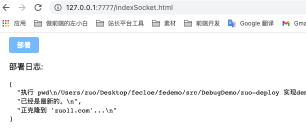
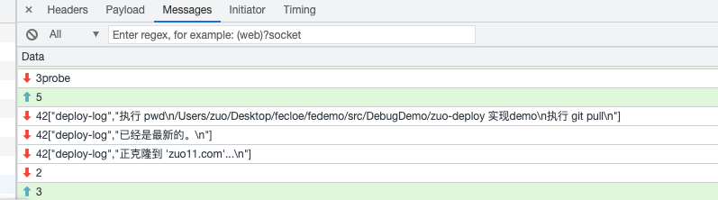

相关问题
1. 关于 http 转 ws 协议，我们可以通过打开 F12 NetWork 面板看前端的 socket 相关连接步骤
- GET `http://127.0.0.1:7777/socket.io/?EIO=4&transport=polling&t=Nz5mBZk` 获取 sid
- POST `http://127.0.0.1:7777/socket.io/?EIO=4&transport=polling&t=Nz5mBaY&sid=DKQAS0fxzXUutg0wAAAG` 
- GET `http://127.0.0.1:7777/socket.io/?EIO=4&transport=polling&t=Nz5mBav&sid=DKQAS0fxzXUutg0wAAAG `
- `ws://127.0.0.1:7777/socket.io/?EIO=4&transport=websocket&sid=DKQAS0fxzXUutg0wAAAG`

ws 这个里面可以看到 socket 传的数据

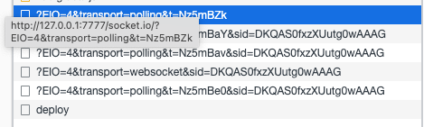

2. http 请求成功状态码一般是 200, ws Status Code 为 101 Switching Protocols

### 2.部署接口添加鉴权
上面只是用接口实现的功能，并没有加权限控制，任何人知道接口地址后，可以通过 postman 请求该接口，触发部署。如下图

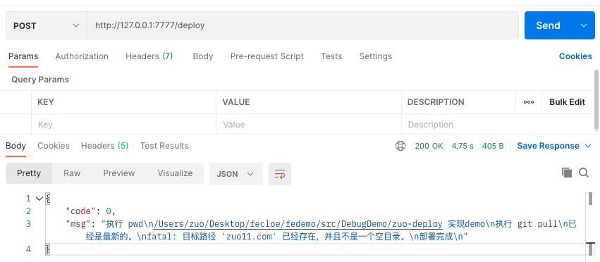

为了安全起见，我们这里为接口添加鉴权，前端增加一个输入密码登录的功能。这里使用 koa-session 来鉴权，只有登录态才能请求成功

```js
// server/indexAuth.js
// npm install koa-session koa-bodyparser --save
// ..
const session = require("koa-session");
const bodyParser = require("koa-bodyparser"); // post 请求参数解析
const app = new Koa();
const router = new KoaRouter();

app.use(bodyParser()); // 处理 post 请求参数

// 集成 session
app.keys = [`自定义安全字符串`]; // 'some secret hurr'
const CONFIG = {
  key: "koa:sess" /** (string) cookie key (default is koa:sess) */,
  /** (number || 'session') maxAge in ms (default is 1 days) */
  /** 'session' will result in a cookie that expires when session/browser is closed */
  /** Warning: If a session cookie is stolen, this cookie will never expire */
  maxAge: 0.5 * 3600 * 1000, // 0.5h
  overwrite: true /** (boolean) can overwrite or not (default true) */,
  httpOnly: true /** (boolean) httpOnly or not (default true) */,
  signed: true /** (boolean) signed or not (default true) */,
  rolling: false /** (boolean) Force a session identifier cookie to be set on every response. The expiration is reset to the original maxAge, resetting the expiration countdown. (default is false) */,
  renew: false /** (boolean) renew session when session is nearly expired, so we can always keep user logged in. (default is false)*/,
};
app.use(session(CONFIG, app));

router.post("/login", async (ctx) => {
  let code = 0;
  let msg = "登录成功";
  let { password } = ctx.request.body;
  if (password === `888888`) { // 888888 为设置的密码
    ctx.session.isLogin = true;
  } else {
    code = -1;
    msg = "密码错误";
  }
  ctx.body = {
    code,
    msg,
  };
});

router.post("/deploy", async (ctx) => {
  if (!ctx.session.isLogin) {
    ctx.body = {
      code: -2,
      msg: "未登录",
    };
    return;
  }
  // 有登录态，执行部署
})
```
前端相关改动，加一个密码输入框、一个登录按钮
```html
<!-- frontend/indexAuth.html 注意id="app"包裹 -->
<div class="login-area">
  <div v-if="!isLogin">
    <el-input v-model="password" type="password" style="width: 200px;"></el-input>
    &nbsp;
    <el-button type="primary" @click="login">登录</el-button>
  </div>
  <div v-else>已登录</div>
</div>
<script>
data() {
  return {
    isLogin: false,
    password: ''
  }
},
methods: {
  login() {
    if (!this.password) {
      this.$message.warning('请输入密码')
      return
    }
    axios.post('/login', { password: this.password })
      .then((response) => {
        console.log(response.data);
        let { code, msg } = response.data
        if (code === 0) {
          this.isLogin = true
        } else {
          this.$message.error(msg)
        }
      })
      .catch(function (err) {
        console.log(err);
        this.$message.error(err.message)
      })
  }
}
</script>
```
node server/indexAuth.js，打开 127.0.0.1:7777/indexAuth.html，登录成功之后才能部署

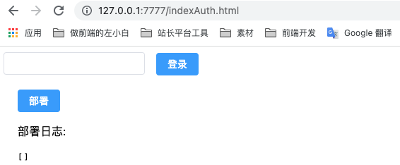

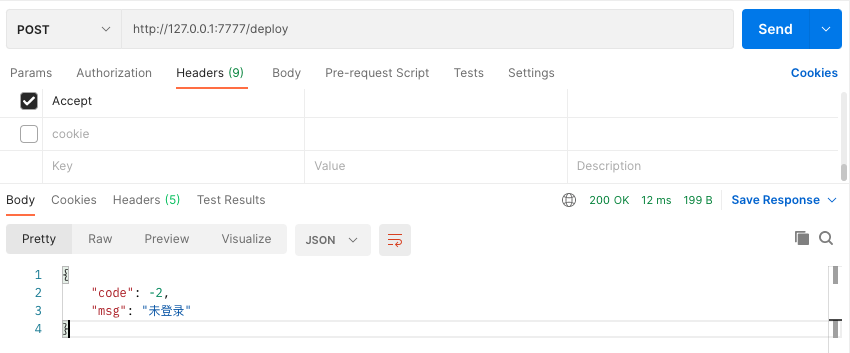

### 3.封装成一个npm包cli工具
为什么封装成 npm 包，使用命令行工具开启服务。主要是简单易用，如果不使用命令行工具形式，需要三步：
1. 先下载代码到服务器
2. npm install
3. node index.js 或者 pm2 start index.js -n xxx 开启服务

改成 npm 包命令行工具形式只需要下面两步，而且更节省时间
1. npm install zuo-deploy pm2 -g
2. 运行 zuodeploy start 会自动使用 pm2 开启服务

下面先来看一个简单的例子，创建一个 npm 包并上传到 npm 官方库步骤
- 需要有 npm 账号，如果没有可以到 https://www.npmjs.com/ 注册一个，我的用户名是 'guoqzuo'
- 创建一个文件夹，用于存放 npm 包内容，比如 npmPackage
- 在该目录下，运行 npm init 初始化一个 package.json，输入的 name 就是 npm 包名，这里我设置 name 为 'zuoxiaobai-test'
  - 包名有两种形式，普通包 vue-cli，作用域包 @vue/cli，区别参见 [npm包前面加@是什么意思(vue-cli与@vue/cli的区别)](http://www.zuo11.com/blog/2020/7/npm_scope.html)
- 一般默认入口为 index.js，暴露出一个变量、一个方法
```js
// index.js
module.exports = {
  name: '写一个npm包',
  doSomething() {
    console.log('这个npm暴露一个方法')
  }
}
```
- 这样就可以直接发布了，创建一个 publish 脚本，并执行（linux 下 chmod +x publish.sh;./publish.sh;）
```bash
# publish.sh
npm config set registry=https://registry.npmjs.org
npm login # 登陆 ，如果有 OTP, 邮箱会接收到验证码，输入即可
# 登录成功后，短时间内会保存状态，可以直接 npm pubish
npm publish # 可能会提示名称已存在，换个名字，获取使用作用域包（@xxx/xxx）
npm config set registry=https://registry.npm.taobao.org # 还原淘宝镜像
```
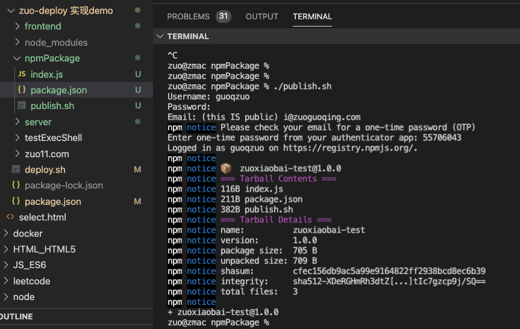

到 npmjs.org 搜索对应包就可以看到了

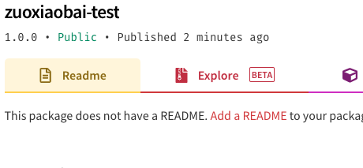

使用该 npm 包，创建 testNpm/index.js
```js
const packageInfo = require('zuoxiaobai-test')

console.log(packageInfo) 
packageInfo.doSomething()
```
在 testNpm 目录下 npm init 初始化 package.json，再 npm install zuoxiaobai-test --save; 再 node index.js，执行情况如下图，调用 npm 包正常

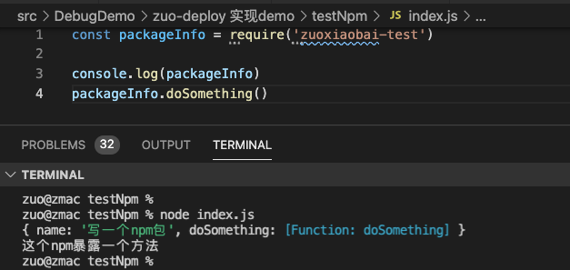

这样我们就知道怎么写一个 npm 包，并上传到 npm 官方库了。

下面，我们来看怎么在 npm 包中集成 cli 命令。举个例子：在 `npm install @vue/cli -g` 后，会在环境变量中添加一个 vue 命令。使用 vue create xx 可初始化一个项目。一般这种形式就是 cli 工具。

一般在 package.json 中有一个 bin 属性，用于创建该 npm 包的自定义命令
```js
// package.json
"bin": {
    "zuodeploy": "./bin/zuodeploy.js"
  },
```
上的配置意思是：全局安装 npm install xx -g 后，生成 zuodeploy 命令，运行该命令时，会执行 bin/zuodeploy.js

本地开发时，配置好后，在当前目录下运行 sudo npm link 即可将 zuodeploy 命令链接到本地的环境变量里。任何 terminal 里面运行 zuodeploy 都会执行当前项目下的这个文件。解除可以使用 npm unlink

一般 cli 都会使用 commander 来生成帮助文档，管理指令逻辑，代码如下

```js
// bin/zuodeploy.js
#!/usr/bin/env node

const { program } = require("commander");
const prompts = require("prompts");

program.version(require("../package.json").version);

program
  .command("start")
  .description("开启部署监听服务") // description + action 可防止查找 command拼接文件
  .action(async () => {
    const args = await prompts([
      {
        type: "number",
        name: "port",
        initial: 7777,
        message: "请指定部署服务监听端口：",
        validate: (value) =>
          value !== "" && (value < 3000 || value > 10000)
            ? `端口号必须在 3000 - 10000 之间`
            : true,
      },
      {
        type: "password",
        name: "password",
        initial: "888888",
        message: "请设置登录密码（默认：888888）",
        validate: (value) => (value.length < 6 ? `密码需要 6 位以上` : true),
      },
    ]);
    require("./start")(args); // args 为 { port: 7777, password: '888888' }
  });

program.parse();
```
使用 commander 可以快速管理、生成帮助文档，分配具体指令的执行逻辑

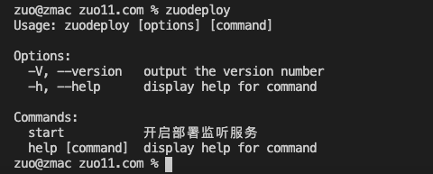

上面的代码中，指定了 start  指令，zuodeploy start 执行时会先通过 prompts 以询问的方式搜集参数，再执行 bin/start.js

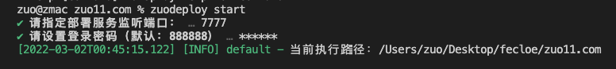

在 start.js 中，我么可以将 server/index.js 的代码全部拷贝过去即可完成 zuodeploy start 开启服务，点击部署的功能

### 4.稳定性提高-pm2改造
为了提升稳定性，我们可以在 start.js 中以代码的方式执行 pm2 src/index.js 这样服务更稳定可靠，另外可以再加入 log4js 输出带时间戳的 log，这样有利于排查问题。

- 具体代码参考：[zuo-deploy -github](https://github.com/dev-zuo/zuo-deploy)
- 所有测试 demo 地址: [zuo-deploy 实现 demo - fedemo -github](https://github.com/dev-zuo/fedemo/tree/master/src/DebugDemo/zuo-deploy%20%E5%AE%9E%E7%8E%B0demo) 

## 最后
将上面零碎的知识点汇聚到一起就是 zuo-deploy 的实现，代码写的比较随意，欢迎 star、fork、提改进 PR！
## 其他问题
### 前端/客户端为什么只有一个 html 没有使用工程化
1. 前端工程化方式组织代码比较重，没必要
2. 这里功能比较简单、只有部署按钮、部署 log 查看区域、鉴权（输入密码）区域
3. 便于部署，直接 koa-static 开启静态服务即可访问，无需打包构建

### 为什么从 type: module 改为普通的 CommonJS
package.json 里面配置 type: module 后默认使用 ES Modules，有些 node 方法会有一些问题

虽然可以通过修改文件后缀为 .cjs 来解决，但文件多了，还不如直接去掉 type: module 使用 node 默认包形式

1. `__dirname` 报错。`__dirname` 对于 cli 项目来讲非常重要。当你需要使用当前项目内文件，而非 zuodeploy start 执行时所在目录的文件时，需要使用 __dirname
2. require("../package.json") 改为 import xx from '../package.json' 引入 JSON 文件时会出错