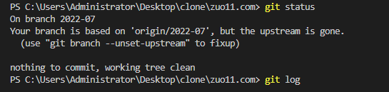

---
{
  "title": "unable to resolve reference 'refs/remotes/origin/2022-07': reference broken",
  "staticFileName": "git-push-error.html",
  "author": "guoqzuo",
  "createDate": "2022/07/31",
  "description": "来看一个 git push 报错的问题，啥也没做，git push 就突然报错了，如下图 error: update_ref failed for ref 'refs/remotes/origin/2022-07': cannot lock ref 'refs/remotes/origin/2022-07': unable to resolve reference 'refs/remotes/origin/2022-07': reference broken, Everything up-to-date。git status 时也会有不正常的提示，如下图",
  "keywords": "git push报错,git push reference broken,update_ref failed for ref 'ORIG_HEAD'",
  "category": "运维部署与版本控制"
}
---

# unable to resolve reference 'refs/remotes/origin/2022-07': reference broken

来看一个 git push 报错的问题，啥也没做，git push 就突然报错了，如下图


## git push异常

error: update_ref failed for ref 'refs/remotes/origin/2022-07': cannot lock ref 'refs/remotes/origin/2022-07': unable to resolve reference 'refs/remotes/origin/2022-07': reference broken
Everything up-to-date

git status 时也会有不正常的提示，如下图



在网上找到一个处理的方法，分两步

```bash
rm .git/refs/remotes/origin/2022-07 # 我这里是报的 2022-07 分支的错，如果是 master 分支就改为 master
git fetch
```

这样就可以正常 git push 了，而且也 git status 没问题了


## git pull 异常

但又发现 git pull 又报错了

fatal: update_ref failed for ref 'ORIG_HEAD': cannot lock ref 'ORIG_HEAD': unable to resolve reference 'ORIG_HEAD': reference broken

需要删除当前项目下 .git/ORIG_HEAD 文件，如下图


删除后就正常了


## 参考

- [Git Error - Unable to resolve reference refs/remotes/origin/master reference broken](https://codeahoy.com/q/2/Git-pull-fails-Unable-to-resolve-reference-refs-remotes-origin-master-reference-broken)
- [git拉取代码报错update_ref failed for ref 'ORIG_HEAD':cannot lock ref 'ORIG_HEAD'](https://blog.csdn.net/Heaven_has_a_way/article/details/112212499)
