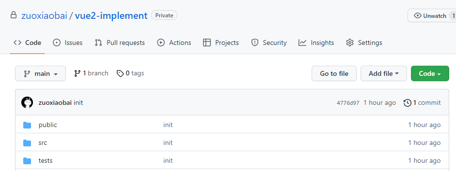
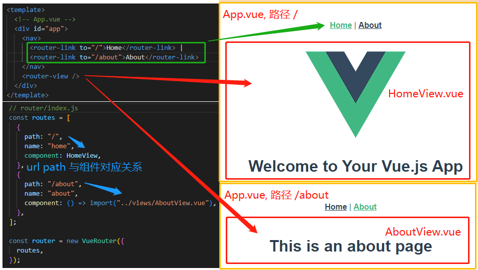
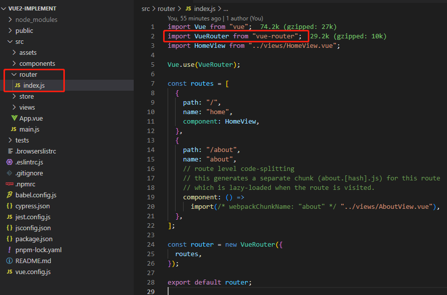

# Vue2全家桶实现: (1)手写实现vue-router

## vue-router 相关面试题

## 实现前准备工作

首先我们使用 `@vue/cli` 生成一个基本的脚手架

```bash
# 这里假设你已经安装了 @vue/cli，如果没安装请先安装
vue create vue2-implement
```

选择 vue2 + vue-router/hash模式 + js + vuex + eslint/prettier + sass + pnpm

在 github/gitlab/gitee... 上创建一个同名仓库，将该项目同步到远程仓库，防止电脑更换，代码丢失



## vue-router基础使用与运行原理

下来看下面这张图

```bash
# 页面 URL(hash模式)
http://localhost:8080/#/  # 首页
http://localhost:8080/#/about # 关于
```

- App.vue 结构页中 router-view 组件用于占位

- 当监听到页面 url 变化时，根据 url - 组件对应关系更新 router-view 占位处显示的组件



更多细节

- 单页面 url 切换，通过监听hashchange 或 history 相关 api触发，分别对应 hash / history 模式
- url 与 组件对应关系，在 new VueRouter() 时，通过 routes 参数传递
- router-view 通过 render 实现，可以根据当前 url （用一个变量存储）实时切换不同组件。当监听到页面url切换时，会修改该变量。
- rotuer-link 以及程序化($router.push等)跳转，会根据路由模式(hash/history) 来决定以什么方式修改页面 url

全局组件 router-view、router-link、$router 等是怎么注入到全局的？

如下图，通过 Vue 插件规范，使用 Vue.use(VueRouter) ，实现 install 方法，注入逻辑



理论上 router/index.js 中可以拿到 router 实例，可以直接 Vue.use(MyPlugin, { someOption: true, router }) 将 router 实例传给 install 方法。

但为什么需要导出 router 实例，然后在 main.js 中 new Vue() 时当做参数传入？这里作为一个思考题，下面我们来看具体实现

```js
// main.js
import Vue from "vue";
import App from "./App.vue";
import router from "./router";
import store from "./store";

Vue.config.productionTip = false;

new Vue({
  router,
  store,
  render: (h) => h(App),
}).$mount("#app");
```

## 开始实现

vue-router 引入逻辑在 src/router/index.js 中，通过 "vue-router" npm 包引入 VueRouter。如果要手写 vue-router，可以从这里入手。

```js
import VueRouter from "vue-router";
```

实现第一步：从我们自己写的 MyVueRouter.js 中引入 VueRouter

```js
import VueRouter form './MyVueRouter.js'
```

MyVueRouter.js

```js
class MyVueRouter {
  constructor() {}
}

export default MyVueRouter;
```

下面实现基础方法、组件

## new VueRouter 路由配置保存

const router = new VueRouter({ routes })；export default router; 需要实现 constructor 构造方法 ，处理传参，返回实例

### url地址与组件对应关系数据打平

### url地址切换监听，更换页面组件

路由切换替换 router-view 逻辑

- hash 模式，监听 hashchange 事件，window.addEventListener('hashchange', cb)
- history 模式，监听 history.back()、history.forward()、history.go() 等，参考：[url 变化监听 - 语雀](https://www.yuque.com/guoqzuo/csm14e/xwagc7#orG4y)

## Vue.use(VueRouter) 插件 install 方法实现

Vue.use(VueRouter) 需要实现 Vue 插件方法 VueRouter.install

全局组件

- router-view 路由组件占位。url 改变时，根据 routes 配置，将 router-view 替换为具体的组件
- router-link  a 标签封装

### 全局组件 router-view

### 全局组件 router-link

### 全局变量 vue-router 实例 $router

为什么在 router.js 中导出 router 后，在 new Vue 时作为参数传入，主要作用是什么？  

注入 `$router` 到所有组件

## 程序化跳转

## 路由钩子（守卫）

## vue-router 插件

## 转载声明

除 微信公众号 可以转载外，其他平台禁止转载
