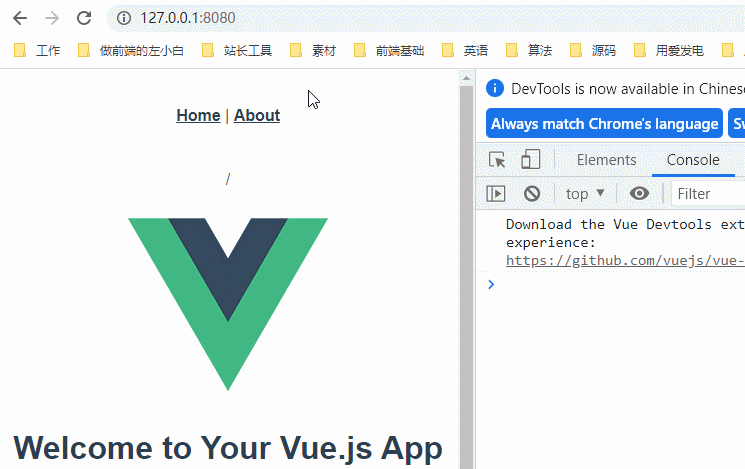

---
{
  "title": "Vue2全家桶实现: (1)mini vue-router",
  "staticFileName": "v2-mini-vue-router.html",
  "author": "guoqzuo",
  "createDate": "2022/07/31",
  "description": "这里尝试自己实现一个简单版本的 vue-router，再结合 vue-router 源码，就可以彻底理解 vue-router 底层逻辑、实现原理。这样以后面试就不怕被问 vue-router 源码相关的面试题了，比如：vue-router 只能在 Vue 中使用，为什么？为什么需要有 router-view，router-view 组件的本质是什么？router-link 和 a 标签的区别在哪？vue-router 是怎么做到在单页面中做到无刷新跳转页面的？hash 模式和 history 模式以及ssr 渲染的 abstract 是怎么运行的？为什么 new Vue 时需要传入 router 实例等",
  "keywords": "vue-router,vue-router源码,vue-router实现,mini vue-router,vue-router底层原理",
  "category": "实现原理与源码"
}
---

# Vue2全家桶实现: (1)mini vue-router

这里尝试自己实现一个简单版本的 vue-router，再结合 vue-router 源码，就可以彻底理解 vue-router 底层逻辑、实现原理。这样以后面试就不怕被问 vue-router 源码相关的面试题了，比如：vue-router 只能在 Vue 中使用，为什么？为什么需要有 router-view，router-view 组件的本质是什么？router-link 和 a 标签的区别在哪？vue-router 是怎么做到在单页面中做到无刷新跳转页面的？hash 模式和 history 模式以及ssr 渲染的 abstract 是怎么运行的？为什么 new Vue 时需要传入 router 实例等

## 实现前准备工作

首先我们使用 `@vue/cli` 生成一个基本的脚手架

```bash
# 这里假设你已经安装了 @vue/cli，如果没安装请先安装
vue create vue2-implement
```

选择 vue2 + vue-router/hash模式 + js + vuex + eslint/prettier + sass + pnpm

在 github/gitlab/gitee... 上创建一个同名仓库，将该项目同步到远程仓库，防止电脑更换，代码丢失


## vue-router基础使用与运行原理

下来看下面这张图

```bash
# 页面 URL(hash模式)
http://localhost:8080/#/  # 首页
http://localhost:8080/#/about # 关于
```

- App.vue 结构页中 router-view 组件用于占位

- 当监听到页面 url 变化时，根据 url - 组件对应关系更新 router-view 占位处显示的组件


更多细节

- 单页面 url 切换，通过监听hashchange 或 history 相关 api触发，分别对应 hash / history 模式
- url 与 组件对应关系，在 new VueRouter() 时，通过 routes 参数传递
- router-view 通过 render 实现，可以根据当前 url （用一个变量存储）实时切换不同组件。当监听到页面url切换时，会修改该变量。
- rotuer-link 以及程序化($router.push等)跳转，会根据路由模式(hash/history) 来决定以什么方式修改页面 url

全局组件 router-view、router-link、$router 等是怎么注入到全局的？

如下图，通过 Vue 插件规范，使用 Vue.use(VueRouter) ，实现 install 方法，注入逻辑


## 开始实现

vue-router 引入逻辑在 src/router/index.js 中，通过 "vue-router" npm 包引入 VueRouter。如果要手写 vue-router，可以从这里入手。

```js
import VueRouter from "vue-router";
```

实现第一步：从我们自己写的 MyVueRouter.js 中引入 VueRouter

```js
import VueRouter form './MyVueRouter.js'
```

MyVueRouter.js

```js
class MyVueRouter {
  constructor() {}
}

export default MyVueRouter;
```

下面实现基础方法、组件

## new VueRouter 路由配置保存

const router = new VueRouter({ routes })；需要实现 constructor 构造方法 ，处理传参

```js
constructor(options) {
    this.options = options;
    this.routeMap = {}; 

    // 利用 Vue 双向绑定、监听到 url 切换后，改变这个值，router-view 组件直接切换
    this.app = new _Vue({
        data: {
            curRoute: "",
        },
    });
}
```

### url地址与组件对应关系数据处理

实现 createRouteMap 方法， routes 数据结构如下

```js
const routes = [
    {
        path: "/",
        name: "home",
        component: HomeView,
    },
    {
        path: "/about",
        name: "about",
        component: () => import("../views/AboutView.vue"),
    },
];
```

创建 routeMap，这里没有考虑路由嵌套，路由嵌套会复杂一点

```js
createRouteMap() {
    this.options.routes.forEach((route) => {
        this.routeMap[route.path] = route.component;
    });
}
```

### url地址切换监听，更换页面组件

路由切换替换 router-view 逻辑

- hash 模式，监听 hashchange 事件，window.addEventListener('hashchange', cb)
- history 模式，监听 history.back()、history.forward()、history.go() 等，参考：[url 变化监听 - 语雀](https://www.yuque.com/guoqzuo/csm14e/xwagc7#orG4y)

这里为方便实现，使用 hash 模式

```js
listenUrlChange() {
    // 首次进入
    window.addEventListener("load", () => {
        this.app.curRoute = window.location.hash.slice(1) || "/";
    });
    // hash 改变
    window.addEventListener("hashchange", (e) => {
        console.log(e);
        // 除了 location 外，还可以用 HashChangeEvent 中的参数
        // { newURL: "http://localhost:8080/#/about" }
        let hashPath = new URL(e.newURL).hash;
        hashPath = hashPath[0] === "#" ? hashPath.substring(1) : "/";
        this.app.curRoute = hashPath;
    });
}
```

## Vue.use(VueRouter) 插件 install 方法实现

Vue.use(VueRouter) 需要实现 Vue 插件方法 VueRouter.install

全局组件

- router-view 路由组件占位。url 改变时，根据 routes 配置，将 router-view 替换为具体的组件
- router-link  a 标签封装

```js
let _Vue = null;

class MyVueRouter {
  // Vue.use(VueRouter) 执行
  static install(Vue) {
    _Vue = Vue; // 保存 Vue，其他地方需要, vue-router 包里面不用包含 Vue

    Vue.mixin({
      beforeCreate() {
        // new Vue({ router }) 时，router 参数，仅在根组件执行一次
        if (this.$options.router) {
          Vue.prototype.$router = this.$options.router; // $route 同理
          this.$options.router.init();
        }
      },
    });
  }
}
```

在 init 方法中执行前面的 createRouteMap 和 listenUrlChange，再加上全局组件的创建

```js
init() {
    this.createRouteMap(); // 根据 routes 拿到 url => 组件 对应关系
    // install 在 new Vue() 之前，双向绑定 curRoute 数据在 new Vue 创建，挪到 init 中处理
    this.initComponent(); 
    this.listenUrlChange();
}
```

### 全局组件 router-view 与 router-link

initComponent 实现

```js
initComponent() {
    // <router-view></router-view>
    _Vue.component("RouterView", {
        render: (h) => {
            let component = this.routeMap[this.app.curRoute];
            return h(component);
        },
    });

    // <router-link to="/about">foo</router-link>
    _Vue.component("RouterLink", {
        props: { to: String },
        render(h) {
            // h(tag, options, children) 子元素使用默认插槽，这里使用简单 hash 模式 #/about
            let options = { attrs: { href: `#${this.to}` } };
            return h("a", options, [this.$slots.default]);
        },
    });
}
```

## 完整代码

下面时 MyVueRouter.js 完整代码，可以运行的完整代码，参见 <https://github.com/zuoxiaobai/vue2-implement>   vue-router 分支

```js
// src/router/MyVueRouter.js
let _Vue = null;

class MyVueRouter {
  // Vue.use(VueRouter) 执行
  static install(Vue) {
    _Vue = Vue; // 保存 Vue，其他地方需要, vue-router 包里面不用包含 Vue

    Vue.mixin({
      beforeCreate() {
        // new Vue() 时，router 参数，仅在根组件执行一次
        if (this.$options.router) {
          Vue.prototype.$router = this.$options.router; // $route 同理
          this.$options.router.init();
        }
      },
    });
  }

  constructor(options) {
    this.options = options;
    this.routeMap = {};

    // 利用 Vue 双向绑定、监听到 url 切换后，改变这个值，router-view 组件直接切换
    this.app = new _Vue({
      data: {
        curRoute: "",
      },
    });
  }

  init() {
    this.createRouteMap(); // 根据 routes 拿到 url => 组件 对应关系
    this.initComponent(); // install 在 new Vue() 之前，双向绑定 curRoute 数据在 new Vue 创建，挪到 init 中处理
    this.listenUrlChange();
  }

  createRouteMap() {
    this.options.routes.forEach((route) => {
      this.routeMap[route.path] = route.component;
    });
  }

  initComponent() {
    // <router-view></router-view>
    _Vue.component("RouterView", {
      render: (h) => {
        let component = this.routeMap[this.app.curRoute];
        return h(component);
      },
    });

    // <router-link to="/about">foo</router-link>
    _Vue.component("RouterLink", {
      props: { to: String },
      render(h) {
        // h(tag, options, children) 子元素使用默认插槽，这里使用简单 hash 模式 #/about
        let options = { attrs: { href: `#${this.to}` } };
        return h("a", options, [this.$slots.default]);
      },
    });
  }

  listenUrlChange() {
    // 首次进入
    window.addEventListener("load", () => {
      this.app.curRoute = window.location.hash.slice(1) || "/";
    });
    // hash 改变
    window.addEventListener("hashchange", (e) => {
      console.log(e);
      // 除了 location 外，还可以用 HashChangeEvent 中的参数 { newURL: "http://localhost:8080/#/about" }
      let hashPath = new URL(e.newURL).hash;
      hashPath = hashPath[0] === "#" ? hashPath.substring(1) : "/"; // http://localhost:8080/#/
      this.app.curRoute = hashPath;
    });
  }
}

export default MyVueRouter;
```

## 功能验证

修改 router/index.js

```js
// import VueRouter from "vue-router";
import VueRouter from "./MyVueRouter";
```

App.vue 中增加 `<p>{{ $router.app.curRoute }}</p>` 查看效果

```html
<template>
  <div id="app">
    <!-- <nav>...</nav> -->
    <p>{{ $router.app.curRoute }}</p>
    <router-view />
  </div>
</template>
```

运行效果良好



## 更深层级探索

上面只是简单的实现了 hash 模式下的基本功能，还有一些功能可以继续深入探索

- 路由嵌套
- history 模式、服务端渲染 'abstract' 模式

- 程序化跳转

- 路由钩子（守卫）
- 动态路由 addRoutes、getRoutes

- vue-router 插件
- 单元测试、e2e test

## vue-router 源码

> 源码地址：<https://github.com/vuejs/vue-router/blob/dev/src/index.js>

弄懂上面的基础逻辑后，再慢慢看源码就简单了。

- 源码里面 index 入口，install、createRouteMap 等基本都是分模块，在多个文件中实现。

- 错误判断更严谨，包含单测、e2e 测试
- 打包、发布等

## 扩展思考

1、Vue.use(VueRouter) 时，可以传入 router 实例，为什么在 new Vue() 时也需要传入？

理论上 router/index.js 中可以拿到 router 实例，可以直接 Vue.use(MyPlugin, { someOption: true, router }) 将 router 实例传给 install 方法。

但为什么需要导出 router 实例，然后在 main.js 中 new Vue() 时当做参数传入？这里作为一个思考题，下面我们来看具体实现

```js
// main.js
import Vue from "vue";
import App from "./App.vue";
import router from "./router";
import store from "./store";

Vue.config.productionTip = false;

new Vue({
  router,
  store,
  render: (h) => h(App),
}).$mount("#app");
```

解答：

上面是 vue2 版本的 vue-router 对应 3.x 版本，在 vue3 对应的版本 4.x 中改进了这一点，下面是官网给出的示例

参考：<https://router.vuejs.org/zh/guide/#javascript>

```js
// vue-router 4.x 版本
// 3. 创建路由实例并传递 `routes` 配置
// 你可以在这里输入更多的配置，但我们在这里
// 暂时保持简单
const router = VueRouter.createRouter({
  // 4. 内部提供了 history 模式的实现。为了简单起见，我们在这里使用 hash 模式。
  history: VueRouter.createWebHashHistory(),
  routes, // `routes: routes` 的缩写
})

// 5. 创建并挂载根实例
const app = Vue.createApp({})
//确保 _use_ 路由实例使
//整个应用支持路由。
app.use(router)

app.mount('#app')

// 现在，应用已经启动了！
```

2、cdn 引入不需要 Vue.use，如果使用模块化机制编程，要调用 Vue.use(VueRouter)，为什么？

在 [vue-router 官网](https://v3.router.vuejs.org/zh/guide/#html) 中有下面一个例子

```js
// 0. 如果使用模块化机制编程，导入Vue和VueRouter，要调用 Vue.use(VueRouter)
// 1. 2. 省略
// 3. 创建 router 实例，然后传 `routes` 配置
// 你还可以传别的配置参数, 不过先这么简单着吧。
const router = new VueRouter({
  routes // (缩写) 相当于 routes: routes
})

// 4. 创建和挂载根实例。
// 记得要通过 router 配置参数注入路由，
// 从而让整个应用都有路由功能
const app = new Vue({
  router
}).$mount('#app')

// 现在，应用已经启动了！
```

解答：

其实 cdn 方式引用时，也调用了 Vue.use 只是 vue-router 内部直接处理的，参考源码

```js
// https://github.com/vuejs/vue-router/blob/dev/src/index.js  292 lines

if (inBrowser && window.Vue) {
  window.Vue.use(VueRouter)
}
```
