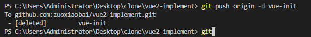

---
{
  "title": "怎么删除远程分支，将删除的本地分支同步到远程",
  "staticFileName": "delete-origin-branch.html",
  "author": "guoqzuo",
  "createDate": "2022/07/31",
  "description": "我们知道删除本地分支是 git branch -d 分支名，但怎么推送到远程呢？需要换个思路，使用 git push origin -d 分支名，这样即可，其中 -d 是 --delete 的简写",
  "keywords": "删除远程分支,delete origin branch,delete remote branch,删除分支,删除本地分支推送到远程",
  "category": "运维部署与版本控制"
}
---

# 怎么删除远程分支，将删除的本地分支同步到远程

删除本地分支

```bash
git branch -d 分支名
```

删除远程分支

```bash
git push origin -d 分支名
```

其中 -d 是 --delete 的简写



参考：[删除本地远程分支](https://blog.csdn.net/qq_45314999/article/details/119639402)
