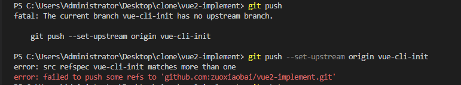

---
{
  "title": "新建分支并推送到远程（好记、超简单命令版）",
  "staticFileName": "new-origin-branch-easy.html",
  "author": "guoqzuo",
  "createDate": "2022/07/31",
  "description": "一般分支都是基于 main 或 master 分支，先切到主分支，基于主分支新建 vue-cli-init 分支、并切换到该分支，使用 git push 推送，会提示push到远程的命令",
  "keywords": "新建远程分支,new branch,推送本地分支到远程,push local branch to remote",
  "category": "运维部署与版本控制"
}
---

# 新建分支并推送到远程（好记、超简单命令版）

一般分支都是基于 main 或 master 分支，先切到主分支

```bash
git checkout master
```

基于主分支新建 vue-cli-init 分支、并切换到该分支

```bash
git checkout -b vue-test-init
```

推送到远程

```bash
git push
```

会提示一个命令，如下图，复制命令，执行即可（命令git push --set-upstream origin vue-cli-init）



这样就可以成功了。

上面提示错误是因为 分支名 和 tag 名称重复了，提交不上去。注意：**分支名不能和 tag名称 重复**
