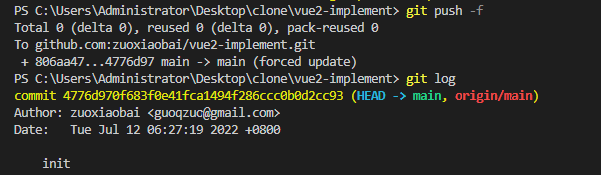

---
{
  "title": "git代码回退，本地版本回退后，怎么push到远程",
  "staticFileName": "git-reset-push-remote.html",
  "author": "guoqzuo",
  "createDate": "2022/07/31",
  "description": "当提交代码有问题，又不小心 push 到远程，怎么回退远程仓库的版本呢？分两步 1. git reset 回退到指定的 commit ID, 2. git push 到远程, git reset 后怎么 push 到远程呢？下面用一个例子来看看，如下图",
  "keywords": "git reset 后怎么 push 到远程,git代码回退,代码回退,版本回退,远程代码回退,代码误提交到远程怎么回退?,",
  "category": "运维部署与版本控制"
}
---

# 代码回退，本地版本回退后，怎么推送到远程

当提交代码有问题，又不小心 push 到远程，怎么回退远程仓库的版本呢？分两步

1. git reset 回退到指定的 commit ID
2. git push 到远程

git reset 后怎么 push 到远程呢？下面用一个例子来看看，如下图


## 代码回退

要将代码回退到 07/12 的版本，使用 git reset commitId 来回退

```bash
git reset 4776d970f683f0e41fca1494f286ccc0b0d2cc93
```


执行完成后，该 commitId 之后提交的代码会处于修改状态（还有没git add），可以在 vscode 里点击撤回修改（对应命令 git checkout -- 需要撤回的文件），这样就彻底还原了。

也可以使用 git reset --hard commitId 这样会自动将 commitId 之后提交的代码全部清除。不需要上面的手动还原

使用 git reflog 可以查看所有操作记录。

## 推送到远程

这个时候千万不要 git pull，如果执行 git pull 又会把回退之前的代码拉下来。和没回退一摸一样

直接推送到远程，git push，提示错误 error: failed to push some refs to 'github.com:zuoxiaobai/vue2-implement.git'

hint: Updates were rejected because the tip of your current branch is behind，

hint: its remote counterpart. Integrate the remote changes (e.g.

hint: 'git pull ...') before pushing again.

hint: See the 'Note about fast-forwards' in 'git push --help' for details.


怎么推送到远程呢？git push -f 强制提交即可, -f 对应 --force，如果远程仓库设置了保护，不允许强制 push, 可以临时解开限制。



参考：[Git回滚版本并push到远端master](https://blog.csdn.net/qq_44885775/article/details/122242183)
