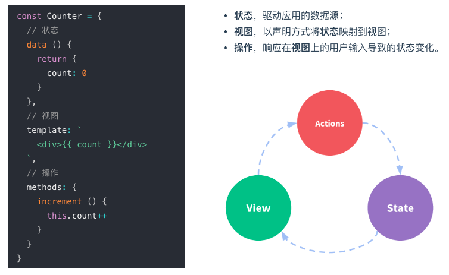
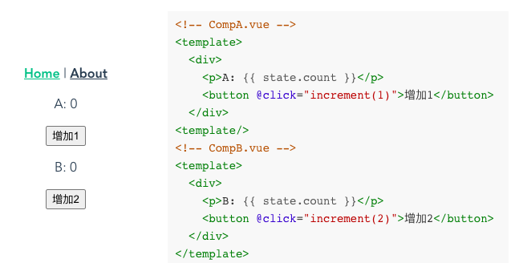
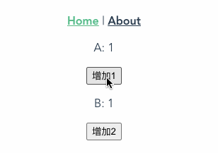

---
{
  "title": "Vue2全家桶实现: (2)vuex原理与实现",
  "staticFileName": "v2-mini-vuex.html",
  "author": "guoqzuo",
  "createDate": "2022/08/07",
  "description": "",
  "keywords": "vuex,vuex源码,vuex实现,mini vuex,vue-router底层原理",
  "category": "实现原理与源码"
}
---

# Vue2全家桶实现: (2)vuex原理与实现

在上一篇中，我们介绍了 vue-router 的简单实现，这里来尝试实现 vuex。可以带着下面几个问题，来深入探索 vuex

- 什么是状态管理？
- 为什么会出现 vuex？什么场景需要使用 vuex？
- vuex 和全局变量有什么区别？
- vuex 为什么和 vue 是强绑定的？
- mutations 中都是方法，为什么需要用 commit 来触发，直接调用不好吗？
- mapState 是怎么实现的？为什么放到 computed 而不是 methods 中
- vue3 官方推荐使用 pinia 代替 vuex，为什么？

往期文章回顾：

1. [Vue2全家桶实现: (1)mini vue-router](https://juejin.cn/post/7126573677176422414)

## 什么是状态管理?

Vuex 是 vue2 官方状态管理（state management）库。那什么是状态管理呢? 来看下面这张图

状态一般指的就是 data 里面的数据，视图指的是页面。状态管理其实就是对 data 数据的管理。



那为什么会出现像 vuex 这种专门用于 data 数据管理的框架呢？它主要用于解决什么问题呢？

- 多个组件需要共用数据、且组件之间传值比较麻烦
- 业务场景复杂，多个组件修改同一数据，不知道是哪个组件修改了公共数据，debug 困难
- 处理共用数据的复杂场景时，不同的开发人员、不同的团队解决方案都不一样，缺少规范

状态管理框架提供了一种处理共用数据的解决方案，比如 vuex，有如下好处：

- 解耦组件之间传值的依赖
- 数据（state）规范化统一管理（vue中大家都按这个约定来，多人协作开发更加高效）
- 支持 devtools 开发调试，Timeline 会记录数据的更改记录，方便 debug

## Vuex 和全局变量有什么区别

理论上数据共用，使用全局变量就可以了，vuex 和全局变量有什么区别呢？

其实 vuex 本质上就是一个全局变量，只是在普通全局变量的基础上进行了一些功能扩展、增强。主要增强如下：

1、普通全局变量无法实现数据修改后页面内容直接刷新，vuex 使用的全局变量 state 就是一个 Vue 实例，state 下的属性存在实例的 data 中，利用 Vue 双向绑定，可以实现 state.xxx 修改后，页面中的内容可以实时刷新

2、

## 全局变量的

我们来尝试实现这个功能，写一个 demo，实现在组件 A、组件B 分别引入一个全局变量 state，再调用全局方法 increment 修改该变量，如下图：



实现 Store.js

- 利用 Vue 双向绑定，创建一个 Vue 实例，当做 state 变量
- 在 Vue 原型上增加 state 属性和 increment 方法，这样我们在任何 Vue 组件都可以获取到。state 也可以在 template 中使用，值修改后，页面内容会同步刷新。

```js
// Store.js
import Vue from "vue";

const state = new Vue({
  data() {
    return {
      count: 0,
    };
  },
});

Vue.prototype.state = state;
Vue.prototype.increment = (num) => {
  state.count += num;
};
```

在 App.vue 中，引入 Store.js，运行后挂载 state, increment 方法；引入组件A、B后运行

实际效果如下图，任一组件修改后，数据都可以正常同步



对于一些简单的数据共用场景，上面这种简单的全局变量的方式就可以了。

## vue全局$store.state实现

## mutation、commit实现

## getters实现

## action、dispatch实现

## mapState辅助函数实现

### export与export default

### mapState语法糖实现

### 放到computed与methods区别

## vuex源码

## vuex与pinia区别

## 最后

## 参考

- [什么是状态管理 - Vue.js](https://cn.vuejs.org/guide/scaling-up/state-management.html#what-is-state-management)
